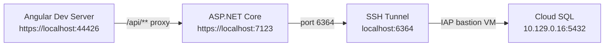

# Local Development Environment Setup

## Prerequisites Check

You need these installed:

- **.NET 9.0 SDK** (the project targets `net9.0`)
- **Node.js 18+** and **npm**
- **gcloud CLI** (confirmed installed)
- **Cloud SQL Auth Proxy** (confirmed installed, though the actual connection uses an SSH tunnel, not the proxy binary)

## Architecture




## Step 1: Start the SSH Tunnel to Cloud SQL

The existing Windows `.bat` scripts won't work on macOS. You need to run the equivalent `gcloud` command directly in a terminal:

```bash
gcloud compute ssh unopsgc567901-sql-proxy \
  --tunnel-through-iap \
  --project=unops-opportunityplus-dev \
  --zone=europe-west4-b \
  --ssh-flag="-L 6364:10.129.0.16:5432"
```

This opens a persistent SSH tunnel: `localhost:6364` -> Cloud SQL `10.129.0.16:5432`. **Keep this terminal open.**

## Step 2: Authenticate with Google Cloud

In a separate terminal, ensure Application Default Credentials are active:

```bash
gcloud auth application-default login
```

This is what the .NET app uses (via `CloudSqlIamAuthProvider`) to generate IAM OAuth2 tokens for the database connection. Tokens refresh automatically every 55 minutes.

## Step 3: Update `appsettings.json` with Your Credentials

File: `[UNOPS.PAO.Server/appsettings.json](UNOPS.PAO.Server/appsettings.json)`

**Changes needed (3 edits):**

1. **Connection string** (line 28) -- change database name and username:
  - `Database=unops-opportunityplus-dev-db-emamirelar`
  - `Username=emamirelar@unops.org`
2. **IAP Simulation user email** (line 105) -- change to your email:
  - `"UserEmail": "emamirelar@unops.org"`

These two changes configure:

- The database the backend connects to (your personal dev DB)
- The simulated authenticated user for local development (bypasses Google IAP which only runs in cloud)

**Exact diff:**

```
ConnectionStrings.DbContext:
  FROM: "Host=127.0.0.1;Port=6364;Database=unops-opportunityplus-dev-db-anushas;Username=anushas@unops.org;"
  TO:   "Host=127.0.0.1;Port=6364;Database=unops-opportunityplus-dev-db-emamirelar;Username=emamirelar@unops.org;"

Development.IAPSimulation.UserEmail:
  FROM: "anushas@unops.org"
  TO:   "emamirelar@unops.org"
```

`UseIamAuthentication: true` stays as-is -- this tells the app to use `gcloud` tokens instead of a static password.

## Step 4: Install Frontend Dependencies

```bash
cd UNOPS.PAO.ClientApp
npm install
cd ..
```

## Step 5: Run the Backend (.NET API)

```bash
dotnet run --project UNOPS.PAO.Server
```

Or with hot reload:

```bash
dotnet watch run --project UNOPS.PAO.Server
```

The backend starts at `https://localhost:7123` (HTTPS) and `http://localhost:5159` (HTTP). On first run it will apply any pending EF migrations and seed workflow data.

## Step 6: Run the Frontend (Angular)

In a separate terminal:

```bash
cd UNOPS.PAO.ClientApp
npm start
```

The Angular dev server starts at `https://localhost:44426` with SSL. The proxy config in `[UNOPS.PAO.ClientApp/src/proxy.conf.js](UNOPS.PAO.ClientApp/src/proxy.conf.js)` automatically forwards `/api/**` and `/user/` requests to the .NET backend at `https://localhost:7123`.

## Summary: 3 Terminals Needed


| Terminal | Command                                       | Purpose                 |
| -------- | --------------------------------------------- | ----------------------- |
| 1        | `gcloud compute ssh ...`                      | SSH tunnel to Cloud SQL |
| 2        | `dotnet watch run --project UNOPS.PAO.Server` | .NET backend API        |
| 3        | `cd UNOPS.PAO.ClientApp && npm start`         | Angular frontend        |


## Access Points

- **App**: `https://localhost:44426`
- **API / Swagger**: `https://localhost:7123/swagger` (Development mode only)
- **Dev login**: Automatic via IAP Simulation (`emamirelar@unops.org`)

## What I Will Change

Only one file needs editing: `[UNOPS.PAO.Server/appsettings.json](UNOPS.PAO.Server/appsettings.json)` -- two string replacements (connection string and simulation email). Everything else is runtime commands.