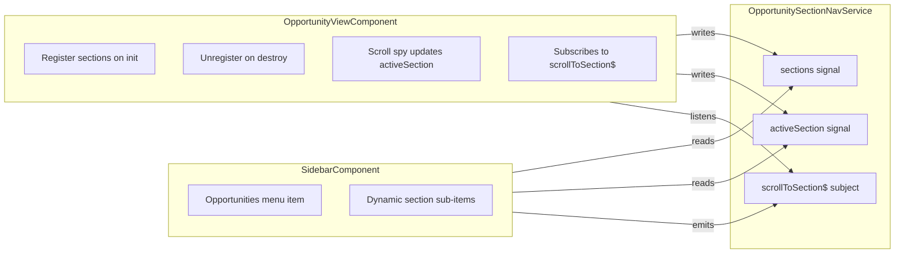

# Move Opportunity Section Navigation to Sidebar

## Architecture

The sidebar and opportunity view are in separate component trees. A lightweight shared service bridges them:




## Key Design Decisions

- **Scroll, not route**: Clicking a section sub-item calls the existing `scrollToSection()` method via the service (uses `Location.replaceState()`, no Angular route reload)
- **Chip bar removed**: The horizontal chip bar (mobile dropdown + desktop chips + "More..." overflow) is removed entirely from `opportunity-view.component.html`
- **Dynamic sub-items**: Section sub-items appear only when `OpportunitySectionNavService.sections()` has items (i.e., when viewing a single opportunity). They disappear on `ngOnDestroy` of the opportunity view
- **"Opportunities" remains clickable**: Its `routerLink` to `/partnerships/opportunities` is preserved, so clicking it navigates to the list page
- **Icons**: Section icons are converted from PrimeNG (`pi-chart-bar`) to Material Symbols (`bar_chart`) for sidebar consistency

## Files to Create

### 1. `[UNOPS.PAO.ClientApp/src/app/shared/services/opportunity-section-nav.service.ts](UNOPS.PAO.ClientApp/src/app/shared/services/opportunity-section-nav.service.ts)`

New service (`providedIn: 'root'`):

```typescript
@Injectable({ providedIn: 'root' })
export class OpportunitySectionNavService {
  readonly sections = signal<{ id: string; label: string; icon: string }[]>([]);
  readonly activeSection = signal<string>('');
  readonly isViewingOpportunity = computed(() => this.sections().length > 0);

  private scrollRequest$ = new Subject<string>();
  readonly onScrollRequest = this.scrollRequest$.asObservable();

  registerSections(sections: { id: string; label: string; icon: string }[]): void;
  unregisterSections(): void;
  setActiveSection(id: string): void;
  requestScrollToSection(id: string): void;
}
```

## Files to Modify

### 2. `[UNOPS.PAO.ClientApp/src/app/layouts/components/menu/menu-item/menu-item.component.ts](UNOPS.PAO.ClientApp/src/app/layouts/components/menu/menu-item/menu-item.component.ts)`

- Inject `OpportunitySectionNavService`
- Add a method `isSectionItem()` that checks `this.item.state?.sectionId`
- Add a method `isSectionActive()` that compares `this.item.state?.sectionId === service.activeSection()`
- No changes to the existing `itemClick` logic (it already handles `command`)

### 3. `[UNOPS.PAO.ClientApp/src/app/layouts/components/menu/menu-item/menu-item.component.html](UNOPS.PAO.ClientApp/src/app/layouts/components/menu/menu-item/menu-item.component.html)`

Add a fourth template block for **command-only items** (no `routerLink`, no `items`):

```html
@if (!item.items && !item.routerLink) {
    <a (click)="itemClick($event)" [attr.tabindex]="0"
        class="flex flex-row items-center justify-start gap-2 py-2 rounded-md cursor-pointer text-text-color hover:bg-surface-hover transition-colors duration-200"
        [ngClass]="{'font-bold text-primary bg-sky-400/[0.1]': isSectionActive()}">
        <span class="material-symbols-outlined text-xl">{{item.icon}}</span>
        <span>{{ item.label! | translate }}</span>
    </a>
}
```

### 4. `[UNOPS.PAO.ClientApp/src/app/layouts/components/sidebar/sidebar.component.ts](UNOPS.PAO.ClientApp/src/app/layouts/components/sidebar/sidebar.component.ts)`

- Inject `OpportunitySectionNavService`
- Add an `effect()` that watches `service.sections()` and `service.activeSection()`
- When sections change, rebuild the `menuItems` array: the Opportunities item gets `items` populated with section MenuItems (each has `command`, `icon`, `label`, and `state: { sectionId }`)
- When sections are empty, rebuild without sub-items
- Section icons mapped to Material Symbols:
  - `analysis` -> `analytics`, `overview` -> `description`, `what` -> `work`, `why` -> `lightbulb`, `who` -> `group`, `where` -> `public`, `when` -> `calendar_today`, `risks` -> `warning`, `related` -> `link`, `collaboration` -> `forum`, `statement` -> `edit_document`, `team` -> `apartment`

### 5. `[UNOPS.PAO.ClientApp/src/app/features/partnerships/opportunities/components/opportunity/view/opportunity-view.component.ts](UNOPS.PAO.ClientApp/src/app/features/partnerships/opportunities/components/opportunity/view/opportunity-view.component.ts)`

- Inject `OpportunitySectionNavService`
- In `ngOnInit` (after data loads): call `service.registerSections(this.sections)`
- In `ngOnDestroy`: call `service.unregisterSections()`
- Subscribe to `service.onScrollRequest` and call the existing `scrollToSection()` method
- In the scroll spy callback (where `activeSection` is updated): also call `service.setActiveSection(sectionId)`
- Remove chip overflow management code: `visibleChips`, `overflowChips`, `hasOverflowChips`, `calculateChipOverflow`, `setupChipOverflowObserver`, `ResizeObserver` logic

### 6. `[UNOPS.PAO.ClientApp/src/app/features/partnerships/opportunities/components/opportunity/view/opportunity-view.component.html](UNOPS.PAO.ClientApp/src/app/features/partnerships/opportunities/components/opportunity/view/opportunity-view.component.html)`

Remove the entire section navigation block (lines ~261-382):

- Mobile/Tablet `p-select` dropdown
- Desktop chips + "More..." overflow dropdown
- `#chipsSizerDiv` and `#chipsContainer` ViewChild references

Keep the workflow component and the loading progress strip (move progress strip above workflow or into an appropriate location if needed).

## What Does NOT Change

- Routing configuration (`opportunities.routes.ts`) -- no new routes needed
- Scroll spy behavior -- still works the same way
- `scrollToSection()` method internals -- reused as-is
- `scrollToSectionInternal()` method -- unchanged
- Section content components -- unchanged
- URL structure (`/partnerships/opportunities/:recordId/:section`) -- unchanged

