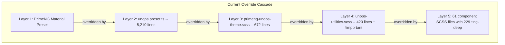
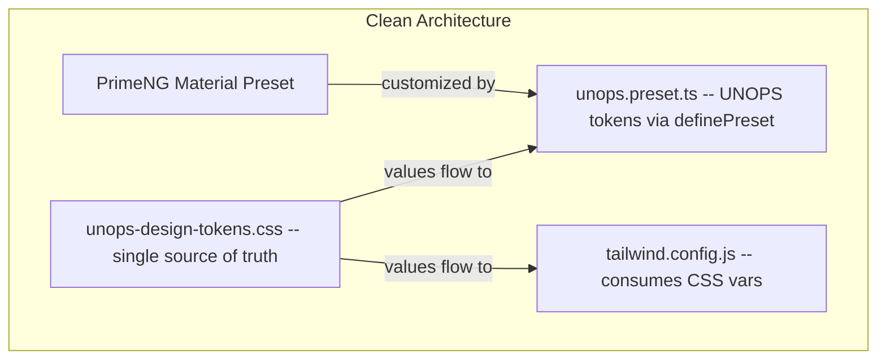

# PrimeNG Override Cleanup

## Current State

5 competing styling layers override each other, producing ~7,700 lines of redundant code:




## Target State




## Decisions

- **Font**: Noto Sans as primary (update CSS tokens to match preset)
- **Dialog mask**: Dark overlay `rgba(0,0,0,0.32)` (remove the white `!important` override from `styles.scss`)
- **Icon button width**: 2.4rem (move from `_common.scss` `!important` into preset)
- **Tab panel bg**: transparent (move from `styles.scss` `!important` into preset)
- **Spinner colors**: `var(--primary-color)` (move from `_common.scss` `!important` into preset)

---

## Phase 1: Consolidate Design Tokens

### 1a. Fix font contradiction

In [unops-design-tokens.css](UNOPS.PAO.ClientApp/src/styles/unops-design-tokens.css) lines 167-168, change `'Inter'` to `'Noto Sans'`:

```css
--font-display: 'Noto Sans', -apple-system, BlinkMacSystemFont, 'Segoe UI', system-ui, sans-serif;
--font-body: 'Noto Sans', -apple-system, BlinkMacSystemFont, 'Segoe UI', system-ui, sans-serif;
```

### 1b. Fix mask contradiction

In [styles.scss](UNOPS.PAO.ClientApp/src/styles.scss) line 17, remove:

```scss
--p-mask-background: rgba(255, 255, 255, 0.5) !important;
```

The preset already defines the correct dark value.

### 1c. Fix tab panel background

In [styles.scss](UNOPS.PAO.ClientApp/src/styles.scss) line 18, remove:

```scss
--p-tabs-tabpanel-background: transparent !important;
```

Add the value to the preset instead in `components.tabs.tabpanel.background`.

### 1d. Fix icon button width and spinner colors

In [public/layout/variables/_common.scss](UNOPS.PAO.ClientApp/public/layout/variables/_common.scss):

- Remove `--p-button-icon-only-width: 2.4rem !important;` -- move into preset `components.button.iconOnlyWidth`
- Remove `--p-progressspinner-color-1` through `--p-progressspinner-color-4 !important` lines -- move into preset `components.progressspinner`

### 1e. Fix breadcrumb !important

In [public/layout/styles/layout/_menu.scss](UNOPS.PAO.ClientApp/public/layout/styles/layout/_menu.scss) line ~165:

- Remove `.p-breadcrumb { background-color: transparent !important; }` -- move into preset `components.breadcrumb`

### 1f. Make Tailwind consume CSS vars

In [tailwind.config.js](UNOPS.PAO.ClientApp/tailwind.config.js), replace hardcoded hex values with `var()` references for all colors that have a corresponding CSS custom property. Example:

```js
'unops-primary': 'var(--unops-primary)',
'unops-secondary': 'var(--unops-secondary)',
// etc.
```

### 1g. Evaluate SCSS token file

In [unops-design-tokens.scss](UNOPS.PAO.ClientApp/src/styles/unops-design-tokens.scss): check if any SCSS variables (`$unops-*`) are consumed by other SCSS files. If only used by files being deleted (like `primeng-unops-theme.scss` and `unops-utilities.scss`), mark for deletion in Phase 2. If used elsewhere, replace hardcoded values with CSS `var()` equivalents.

---

## Phase 2: Migrate SCSS Overrides into Preset

Work component-by-component through [primeng-unops-theme.scss](UNOPS.PAO.ClientApp/src/styles/primeng-unops-theme.scss) (672 lines). For each block:

1. Comment it out
2. Check if the preset already produces correct styling
3. If not, add/fix the preset tokens in [unops.preset.ts](UNOPS.PAO.ClientApp/src/styles/themes/unops.preset.ts)
4. Delete the commented block

### 2a. Buttons (.p-button) -- primeng-unops-theme.scss lines 9-187

Verify `components.button` in preset covers all variants (primary, secondary, text, outlined, icon-only, severity states, hover/focus/active). Remove from SCSS.

### 2b. Inputs (.p-inputtext, .p-dropdown, .p-multiselect) -- lines 193-357

Verify `components.inputtext`, `components.select`, `components.multiselect` in preset. Remove from SCSS.

### 2c. Cards and Panels (.p-card, .p-panel) -- lines 363-447

Verify `components.card`, `components.panel` in preset. Remove from SCSS.

### 2d. Dialogs (.p-dialog) -- lines 508-594

Verify `components.dialog` in preset (including mask background now using dark value). Remove from SCSS.

### 2e. Tables (.p-datatable) -- lines 600-656

Verify `components.datatable` in preset. Remove from SCSS.

### 2f. Menus, Toasts, Tooltips, Progress (.p-menu, .p-toast, .p-tooltip, .p-progressbar) -- lines 453-811

Verify respective `components.*` preset sections. Remove from SCSS.

### 2g. Icon button utility (.unops-icon-button) -- lines 818-end

Replace with Tailwind classes or preset token. Remove from SCSS.

After all blocks are migrated, **delete** `primeng-unops-theme.scss` and remove its `@use` from `styles.scss` (line 6).

### 2h. Clean up utility classes

In [unops-utilities.scss](UNOPS.PAO.ClientApp/src/styles/unops-utilities.scss):

- Remove `.unops-button-primary` (lines ~55-84)
- Remove `.unops-button-secondary` (lines ~87-115)
- Remove `.unops-button-text` (lines ~118-143)
- Remove `.unops-card` / `.unops-card-elevated` (lines ~149-170)
- Remove `!important` from remaining utility classes

**Template migration** (2 files use `unops-button-primary`):

- [dashboard-card.component.html](UNOPS.PAO.ClientApp/src/app/shared/components/data-display/dashboard-card/dashboard-card.component.html) line 108: replace `class="p-button-sm unops-button-primary"` with PrimeNG `severity="primary"` + `size="small"`
- [home-dashboard.component.html](UNOPS.PAO.ClientApp/src/app/features/home/components/home-dashboard/home-dashboard.component.html) lines 127, 154, 163, 172, 181, 210, 236, 245, 254, 263, 783: replace all `unops-button-primary` usages

### 2i. Clean up design tokens CSS

In [unops-design-tokens.css](UNOPS.PAO.ClientApp/src/styles/unops-design-tokens.css):

- Remove `.unops-button-primary` class (lines ~289-307)
- Remove `.unops-button-secondary` class (lines ~309-327)
- Remove `.unops-card` class (lines ~281-287)

---

## Phase 3: Eliminate ::ng-deep

With global theming fixed in Phase 2, most `::ng-deep` overrides targeting `.p-`* classes become unnecessary. For each of the 61 files:

1. Remove `::ng-deep` wrapper
2. If the style targets a PrimeNG component class (`.p-`*) for theming purposes, verify the preset handles it and delete the rule
3. If the style is a legitimate layout/sizing concern (e.g., constraining dialog width in a specific context), keep it but move to `:host ::ng-deep` replacement patterns:
  - Use `:host` with `ViewEncapsulation.None` if the component only has a few layout overrides
  - Or move the rule to a global stylesheet section

### Files by area (61 files, 229 usages)

**3a. Opportunities (19 files, 25 usages)**: Many share the same mixin-style block for `.p-inputtextarea`, `.p-floatlabel`, `.p-datepicker`. Once the preset handles these, all 19 files can have their `::ng-deep` blocks removed.

**3b. AI (6 files, 100 usages)**: Heaviest area. `ai-panel.component.scss` (46 usages) and `ai-assistant-panel.component.scss` (29 usages) need careful review -- many target `.p-menu`, `.p-overlaypanel` for layout sizing, not just theming. These may need a few rules kept as `:host` styles.

**3c. Partners (11 files, 35 usages)**: Includes organization chart, tree table, avatar customizations. Some may be legitimate layout overrides.

**3d. Layouts (8 files, 19 usages)**: Sidebar, topbar, global-filters-dialog, breadcrumb, org-unit-selector. Dialog sizing rules may need to stay as global styles.

**3e. Shared (8 files, 38 usages)**: Timeline (22 usages targeting vis.js, not PrimeNG -- keep as-is), workflow, document-upload.

**3f. Admin/Other (9 files, 12 usages)**: Login, user-management, entity-manager, search-result.

---

## Phase 4: Guardrails

### 4a. Cursor rule update

Update [.cursor/rules/design-system-protection.mdc](/.cursor/rules/design-system-protection.mdc) to add:

- No `.p-`* class overrides in component SCSS -- all PrimeNG styling goes through the preset
- No new `::ng-deep` without explicit approval
- No `!important` on PrimeNG CSS variables
- Design token value changes only in `unops-design-tokens.css`

### 4b. Stylelint rule (optional)

Add a stylelint rule to warn on `::ng-deep` and `.p-`* selectors in component SCSS files.

---

## Verification Strategy

After each sub-phase:

1. Run `ng build` to confirm no compilation errors
2. Visually check key pages: Home dashboard, Partner list/detail, Opportunity detail, AI assistant panel, Admin entity manager
3. Compare screenshots before/after for regression

## Expected Outcome

- ~5,000+ lines of redundant code removed
- `primeng-unops-theme.scss` deleted entirely (672 lines)
- Significant reduction in `unops-utilities.scss` (~100 lines removed)
- 229 `::ng-deep` usages eliminated or reduced to <10 legitimate layout overrides
- Single source of truth for all design token values
- PrimeNG upgrades become safe

