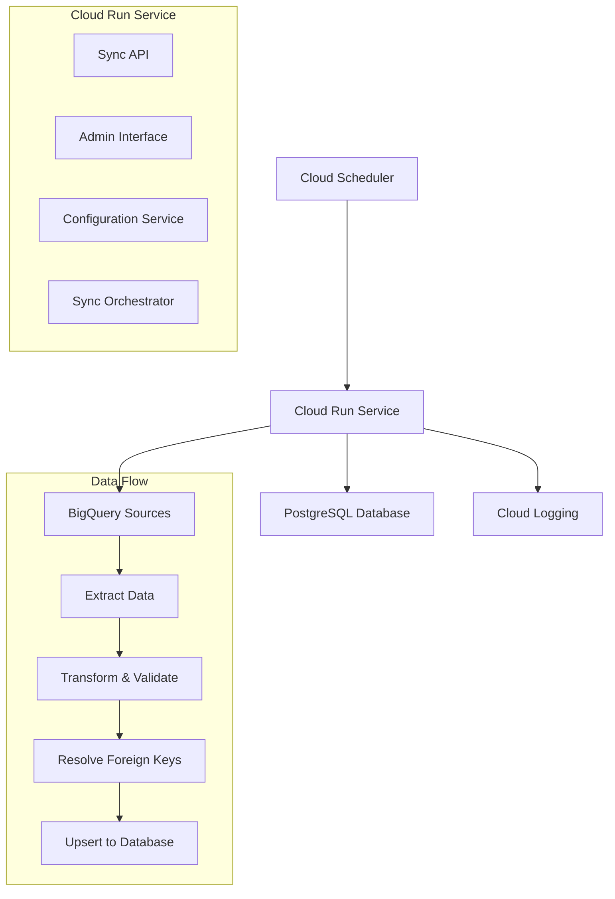

# UNOPS PAO External Data Integration Service

A configurable, cloud-native service for synchronizing external data sources (BigQuery) into the UNOPS PAO application database. Built on .NET 8 and designed for Google Cloud Platform deployment.

## 🎯 Overview

The External Data Integration Service provides a configuration-driven approach to synchronize data from BigQuery sources into PostgreSQL databases. Key features include:

- **Configuration-driven**: No code changes needed for new data sources
- **Dynamic table management**: Automatically creates and updates destination tables
- **Foreign key resolution**: Maps external references to internal application IDs  
- **Comprehensive logging**: Full audit trail with execution tracking
- **Cloud-native**: Optimized for Google Cloud Run with auto-scaling
- **Admin interface**: Web-based monitoring and management dashboard
- **Scheduled execution**: Integration with Cloud Scheduler for automated syncs

## 🏗️ Architecture



### Database Schema Organization

The service uses **two separate databases** with distinct purposes:

#### **Monitoring Database** (Service's Own Database)
- **`external` schema**: Contains service monitoring and logging tables
  - `SyncExecutionLogs` - Tracks each sync execution (success/failure, duration, records processed)
  - `SyncBatchLogs` - Tracks batch processing within each sync operation  
  - `SyncErrorLogs` - Records errors and exceptions during sync operations
  - `ConfigurationExecutionHistory` - Tracks sync configuration execution history and schedules

#### **Application Database** (Main UNOPS PAO Database)  
- **Configurable schemas**: External data destination schema is configurable per sync (commonly `integration`)
  - `integration.ExternalPartners` - Partner data synchronized from external CRM systems
  - `integration.ExternalProjects` - Project data from external project management systems
  - `public.ExternalOpportunities` - Opportunity data (if configured for public schema)
  - `crm_data.ExternalContacts` - Contact information (custom schema example)
  - *[Schema and table names determined by individual sync configurations]*

- **`public` schema**: Contains the application's data and reference data for foreign key resolution
  - `Countries` - Country lookup table for resolving country codes to IDs
  - `GeoRegions` - Geographic region lookup table
  - *[Other application reference tables managed by main UNOPS PAO app]*

**Data Flow**: `BigQuery → Service Processing → {schema}.{table} (Application DB)` + `external.SyncLogs (Monitoring DB)`
- Schema and table names are **configurable per sync** via YAML configuration

## 🚀 Quick Start

### Local Development (Direct .NET Run)

The quickest way to run the service for testing is directly with the `dotnet` command:

#### Prerequisites
- .NET 8 SDK
- CloudSQL proxy running (if using Google Cloud SQL)
- Google Cloud SDK (for BigQuery authentication)

#### Database Setup with CloudSQL

1. **Connect to your CloudSQL instance:**
   
   **If you already have CloudSQL proxy running:**
   ```bash
   # Your proxy should be running (example):
   # ./cloud-sql-proxy.x64.exe --port 5433 your-project:region:instance-name
   
   # Connect through the proxy
   psql -h localhost -p 5433 -U your-username -d postgres
   ```
   
   **Alternative - Direct gcloud connection:**
   ```bash
   gcloud sql connect your-instance-name --user=postgres
   ```

2. **Setup database connections:**
   
   The external data service uses **two separate databases**:
   - **Application Database**: The main UNOPS PAO database (contains reference data and destination tables)
   - **Monitoring Database**: Service-specific database for sync logs and monitoring
   
   **Option A: Google Cloud Console (Web Interface - Recommended):**
   
   *Create the Monitoring Database:*
   1. Go to [Google Cloud Console](https://console.cloud.google.com/)
   2. Navigate to **SQL** in the left sidebar
   3. Click on your instance (e.g., `unops-partneropportunity-qa`)
   4. Go to the **Databases** tab
   5. Click **"Create Database"**
   6. Enter database name: `unops_pao_external_data_monitoring_dev`
   7. Click **Create**
   
   *The main UNOPS PAO database should already exist for your application*

   **Option B: Command Line (via psql):**
   ```bash
   # Connect to your CloudSQL instance through the proxy
   psql -h localhost -p 5433 -U your-username -d postgres
   ```
   
   Then run these SQL commands in the PostgreSQL prompt:
   ```sql
   -- Create monitoring database for the external data service
   CREATE DATABASE unops_pao_external_data_monitoring_dev;
   
   -- The main UNOPS PAO database should already exist
   -- If not, create it: CREATE DATABASE unops_pao_dev;
   
   CREATE USER dev WITH PASSWORD 'your-secure-password';
   GRANT ALL PRIVILEGES ON DATABASE unops_pao_external_data_monitoring_dev TO dev;
   GRANT ALL PRIVILEGES ON DATABASE unops_pao_dev TO dev;
   \q
   ```

3. **Initialize the monitoring database schema:**
   ```bash
   # Run the initialization script for monitoring database through CloudSQL proxy
   psql -h localhost -p 5433 -U dev -d unops_pao_external_data_monitoring_dev -f init-db.sql
   ```
   
   **Notes**: 
   - The main application database schema is managed by the main UNOPS PAO application, not this service
   - Monitoring tables (SyncExecutionLogs, SyncBatchLogs, etc.) are created automatically by the service on startup
   - No Entity Framework migrations needed - the service uses simple table creation logic

#### Configuration

1. **Update connection strings for CloudSQL proxy:**
   
   **Option A: Environment variables (recommended):**
   ```bash
   # Windows PowerShell
   $env:ConnectionStrings__ApplicationConnection = "Host=localhost;Database=unops_pao_dev;Username=dev;Password=your-secure-password;Port=5433;"
   $env:ConnectionStrings__MonitoringConnection = "Host=localhost;Database=unops_pao_external_data_monitoring_dev;Username=dev;Password=your-secure-password;Port=5433;"
   $env:BigQuery__ProjectId = "your-bigquery-project-dev"
   
   # Windows Command Prompt  
   set ConnectionStrings__ApplicationConnection=Host=localhost;Database=unops_pao_dev;Username=dev;Password=your-secure-password;Port=5433;
   set ConnectionStrings__MonitoringConnection=Host=localhost;Database=unops_pao_external_data_monitoring_dev;Username=dev;Password=your-secure-password;Port=5433;
   set BigQuery__ProjectId=your-bigquery-project-dev
   
   # Linux/Mac
   export ConnectionStrings__ApplicationConnection="Host=localhost;Database=unops_pao_dev;Username=dev;Password=your-secure-password;Port=5433;"
   export ConnectionStrings__MonitoringConnection="Host=localhost;Database=unops_pao_external_data_monitoring_dev;Username=dev;Password=your-secure-password;Port=5433;"
   export BigQuery__ProjectId="your-bigquery-project-dev"
   ```

   **Option B: Modify appsettings.Development.json:**
   ```json
   {
     "ConnectionStrings": {
       "ApplicationConnection": "Host=localhost;Database=unops_pao_dev;Username=dev;Password=your-secure-password;Port=5433;",
       "MonitoringConnection": "Host=localhost;Database=unops_pao_external_data_monitoring_dev;Username=dev;Password=your-secure-password;Port=5433;"
     },
     "BigQuery": {
       "ProjectId": "your-bigquery-project-dev",
       "UseDefaultCredentials": true
     }
   }
   ```

2. **Set BigQuery project (if needed):**
   ```bash
   # Authenticate with Google Cloud
   gcloud auth application-default login
   
   # Set your project ID in appsettings.Development.json or via environment variable
   $env:BigQuery__ProjectId = "your-gcp-project-id"
   ```

#### Run the Service

```bash
# Navigate to the service directory
cd UNOPS.PAO.ExternalDataService

# Run in development mode
dotnet run --environment Development
```

#### Access Points

Once running, the service will be available at:
- **Main service**: http://localhost:8080
- **Admin interface**: http://localhost:8080/admin  
- **API documentation**: http://localhost:8080/swagger
- **Health check**: http://localhost:8080/health

### Local Development with Docker

1. **Clone and setup**:
```bash
git clone <repository>
cd UNOPS.PAO.ExternalDataService
```

2. **Start services**:
```bash
docker-compose up -d
```

3. **Access the application**:
- Service: http://localhost:8080
- Admin interface: http://localhost:8080/admin
- API docs: http://localhost:8080/swagger
- Database admin: http://localhost:8081 (pgAdmin)

### Manual Development Setup

1. **Prerequisites**:
   - .NET 8 SDK
   - PostgreSQL 13+
   - Google Cloud SDK (for BigQuery)

2. **Database setup**:
```bash
createdb unops_pao_external_data_dev
psql -d unops_pao_external_data_dev -f init-db.sql
```

3. **Run the service**:
```bash
dotnet run --environment Development
```

## 📋 Configuration

### Environment Variables

| Variable | Description | Default |
|----------|-------------|---------|
| `ASPNETCORE_ENVIRONMENT` | Environment (Development/Production) | `Production` |
| `ConnectionStrings__DefaultConnection` | PostgreSQL connection string | Required |
| `ConnectionStrings__ApplicationConnection` | Application database connection string | Falls back to DefaultConnection |
| `ExternalDataService__ConfigurationPath` | Path to config files | `./config` |
| `BigQuery__ProjectId` | Default BigQuery project ID (fallback) | Optional |
| `AdminApiKey` | API key for admin access | Generated |

### BigQuery Project Configuration Priority

The BigQuery project ID is resolved in the following order:
1. **Sync configuration**: `source.connection.project_id` in YAML file
2. **Environment variable fallback**: `BigQuery__ProjectId` environment variable
3. **Appsettings fallback**: `BigQuery.ProjectId` in appsettings.json
4. **Error**: If neither is specified, sync will fail with clear error message

This allows you to:
- Set environment-specific project IDs in appsettings
- Override per sync if needed
- Centralize project configuration across multiple syncs

### Sync Configuration Files

Create YAML files in the `config/` directory to define sync operations:

**Example 1: Using `integration` schema with explicit BigQuery project**
```yaml
metadata:
  name: "Partner Data Sync"
  enabled: true
  schedule_cron: "0 6 * * *"  # Daily at 6 AM

source:
  type: "bigquery"
  connection:
    project_id: "your-bigquery-project"  # Explicit project ID
    use_environment_auth: true
  query: |
    SELECT id, name, email, updated_at
    FROM partners
    WHERE updated_at >= @last_sync_date

destination:
  table_name: "ExternalPartners"
  schema: "integration"  # Creates: integration.ExternalPartners
  field_mappings:
    - source_field: "id"
      destination_field: "ExternalId"
      data_type: "varchar(100)"
      is_unique: true
```

**Example 1b: Using appsettings fallback for BigQuery project**
```yaml
metadata:
  name: "Partner Data Sync - Appsettings Project"
  enabled: true
  schedule_cron: "0 6 * * *"  # Daily at 6 AM

source:
  type: "bigquery"
  connection:
    # project_id: omitted - uses appsettings.json BigQuery.ProjectId
    use_environment_auth: true
  query: |
    SELECT id, name, email, updated_at
    FROM partners
    WHERE updated_at >= @last_sync_date

destination:
  table_name: "ExternalPartners"
  schema: "integration"  # Creates: integration.ExternalPartners
  field_mappings:
    - source_field: "id"
      destination_field: "ExternalId"
      data_type: "varchar(100)"
      is_unique: true
```

**Example 2: Using `public` schema**
```yaml
destination:
  table_name: "ExternalContacts"
  schema: "public"  # Creates: public.ExternalContacts
  field_mappings:
    - source_field: "contact_id"
      destination_field: "ExternalId"
      data_type: "varchar(50)"
      is_unique: true
```

**Example 3: Custom schema**
```yaml
destination:
  table_name: "CrmPartners"
  schema: "crm_data"  # Creates: crm_data.CrmPartners
  field_mappings:
    - source_field: "partner_id"
      destination_field: "PartnerId"
      data_type: "varchar(100)"
      is_unique: true
```

**Example 4: Default schema (omit schema field)**
```yaml
destination:
  table_name: "ExternalProjects"
  # schema: omitted - defaults to "public"
  field_mappings:
    - source_field: "project_id"
      destination_field: "ExternalProjectId"
      data_type: "varchar(50)"
      is_unique: true
```

See [Configuration Guide](config/README.md) for complete documentation.

## 🔧 Features

### Data Sources
- **BigQuery**: Production-ready connector with authentication
- **Extensible**: Framework supports additional source types

### Destination Management
- **Auto-table creation**: Creates tables from field mappings using simple SQL
- **Flexible schema assignment**: Configure destination schema per sync (`integration`, `public`, or custom)
- **Schema updates**: Adds new columns automatically
- **Audit fields**: Tracks sync metadata (created by, sync date, etc.)
- **Simple approach**: Uses raw SQL - no Entity Framework overhead

### Data Processing
- **Field transformations**: 15+ built-in transformations (trim, format, validate)
- **Foreign key resolution**: Maps external values to internal IDs
- **Validation**: Data quality checks with configurable actions
- **Batch processing**: Handles large datasets efficiently

### Monitoring & Operations
- **Execution logging**: Complete audit trail in database
- **Error tracking**: Detailed error logs with resolution status
- **Health checks**: Built-in health monitoring
- **Admin dashboard**: Web interface for monitoring and control
- **Cloud integration**: Native Cloud Logging and Monitoring

## 🌐 Deployment

### Google Cloud Platform (Recommended)

1. **Quick deployment**:
```bash
cd deploy
./deploy.sh production your-project-id
```

2. **Development deployment**:
```bash
./deploy-dev.sh your-dev-project
```

### Manual Cloud Run Deployment

1. **Build and push**:
```bash
docker build -t gcr.io/PROJECT_ID/external-data-service .
docker push gcr.io/PROJECT_ID/external-data-service
```

2. **Deploy**:
```bash
gcloud run deploy external-data-service \
  --image gcr.io/PROJECT_ID/external-data-service \
  --region us-central1 \
  --cpu 2 --memory 4Gi
```

3. **Setup Cloud Scheduler**:
```bash
gcloud scheduler jobs create http daily-partner-sync \
  --schedule="0 6 * * *" \
  --uri="SERVICE_URL/api/sync/execute/partners"
```

## 📊 API Reference

### Sync Operations
```http
POST /api/sync/execute/{configurationName}
POST /api/sync/execute-all
POST /api/sync/pubsub
```

### Monitoring
```http
GET /api/sync/status
GET /api/sync/configurations
GET /health
```

### Admin Interface
```http
GET /admin                    # Dashboard
POST /admin/sync/{config}     # Manual execution
GET /admin/execution/{id}     # Execution details
```

## 🔒 Security

### Authentication
- **Cloud Run**: IAM-based service authentication
- **Admin interface**: API key authentication
- **BigQuery**: Service account authentication

### Data Protection
- **Connection encryption**: TLS for all connections
- **Credential management**: Google Secret Manager integration
- **Audit logging**: Complete operation audit trail
- **Network security**: Private Cloud Run configuration available

### Best Practices
1. Use least-privilege service accounts
2. Enable audit logging
3. Rotate API keys regularly
4. Monitor failed authentication attempts
5. Use VPC connectors for database access

## 📈 Performance & Scaling

### Optimization Features
- **Batch processing**: Configurable batch sizes (default: 1000)
- **Parallel processing**: Multiple batches processed concurrently
- **Incremental sync**: Only processes changed records
- **Connection pooling**: Efficient database connections
- **Caching**: Foreign key lookup caching

#### Batch Processing Details

The `batch_size` configuration parameter is a critical performance optimization that controls how many records are processed together in a single batch during data synchronization operations.

**Key Benefits:**

1. **Memory Management**
   - Instead of loading all records into memory at once (which could cause memory issues with large datasets), the service processes data in smaller, manageable chunks
   - Default value is **1000 records** per batch, configurable per sync configuration

2. **Database Performance Optimization**
   - **Prevents database overwhelming**: Smaller batches avoid putting excessive load on the database
   - **Connection efficiency**: Each batch is processed as a unit, reducing connection overhead
   - **Transaction management**: Each batch can be processed in its own transaction scope

3. **Error Isolation**
   - If one batch fails, other batches can still succeed
   - Provides granular error reporting and recovery capabilities
   - Failed batches can be retried independently

4. **Progress Tracking and Logging**
   - Enables detailed progress reporting (e.g., "Processing batch 5 of 20")
   - Provides fine-grained logging for monitoring and debugging
   - Allows for partial completion tracking

**Configuration Examples:**
```yaml
source:
  batch_size: 100    # Basic template default
  # batch_size: 500  # Complex/high-volume template
  # batch_size: 3    # Development/testing (detailed debugging)
```

**How it Works:**
The service automatically chunks extracted records into batches of the specified size, processes each batch sequentially with a small delay (100ms) between batches to prevent overwhelming the database, and provides comprehensive logging throughout the process.

**Performance Tuning:**
- **Small datasets** (< 10K records): Use smaller batches (100-500) for better progress tracking
- **Large datasets** (> 100K records): Use larger batches (500-1000) for efficiency
- **Development/Testing**: Use very small batches (3-10) for detailed debugging
- **Memory-constrained environments**: Reduce batch size to lower memory usage

### Scaling Configuration
- **Cloud Run**: Auto-scales from 0 to 100 instances
- **Memory**: 512MB to 8GB per instance
- **CPU**: 0.5 to 4 vCPUs per instance
- **Concurrency**: Up to 1000 requests per instance

### Performance Metrics
| Dataset Size | Sync Time | Memory Usage |
|--------------|-----------|--------------|
| 1K records   | 30s       | 512MB        |
| 10K records  | 2min      | 1GB          |
| 100K records | 15min     | 2GB          |
| 1M records   | 2hr       | 4GB          |

## 🛠️ Development

### Project Structure
```
UNOPS.PAO.ExternalDataService/
├── Controllers/           # HTTP API controllers
├── Services/             # Core business logic
│   ├── Configuration/    # Config loading and validation
│   ├── DataSource/       # BigQuery integration
│   ├── Database/         # Table and FK management
│   └── Sync/             # Sync orchestration
├── Models/               # Data models
├── Infrastructure/       # Database contexts and utilities
├── Views/                # Admin interface
├── config/               # Configuration files
├── deploy/               # Deployment scripts
└── logs/                 # Application logs
```

### Development Workflow
1. **Create configuration**: Copy template and customize
2. **Test locally**: Use Docker Compose environment
3. **Validate**: Use admin interface to test configuration
4. **Deploy**: Use deployment scripts for staging/production

### Adding New Data Sources
1. Implement `IDataSourceService`
2. Add to `DataSourceFactory`
3. Update configuration validation
4. Add authentication support

## 📝 Troubleshooting

### Common Issues

**Configuration not loading**
- Verify YAML syntax
- Check file permissions
- Review logs for parsing errors

**BigQuery connection failed**
- Verify project ID and credentials
- Check IAM permissions
- Test with simple query

**Sync performance issues**
- Reduce batch size
- Add database indexes
- Enable parallel processing
- Check query performance

**Memory issues**
- Reduce batch size
- Increase Cloud Run memory limit
- Check for memory leaks in transformations

### Debug Mode
Enable detailed logging:
```yaml
logging:
  log_level: "Debug"
  log_sql_queries: true
  log_record_details: true
```

### Health Checks
- Service health: `GET /health`
- Database connectivity: Included in health check
- BigQuery connectivity: Test via admin interface

## 📚 Additional Resources

- [Configuration Guide](config/README.md) - Complete configuration documentation
- [Deployment Guide](deploy/README.md) - Detailed deployment instructions
- [API Documentation](https://service-url/swagger) - Interactive API docs
- [Admin Interface](https://service-url/admin) - Web-based management

## 🤝 Contributing

1. Follow existing code patterns and conventions
2. Add comprehensive tests for new features
3. Update documentation for any changes
4. Use meaningful commit messages
5. Test in development environment before PR

## 📄 License

Copyright (c) 2024 UNOPS. All rights reserved.

## 🆘 Support

For issues and questions:
- Review logs at `/logs` or Cloud Logging
- Use admin interface for monitoring
- Check API documentation at `/swagger`
- Contact the data integration team

---

**Version**: 1.0.0  
**Last Updated**: 2024  
**Platform**: .NET 8, Google Cloud Platform
