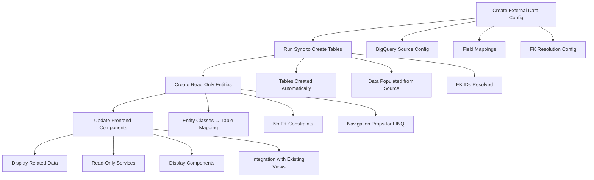

# External Read-Only Entity Implementation Guide (External Data Service Integration)

## Overview

This guide provides a streamlined approach for implementing new **read-only entities** in the UNOPS PAO application that map to **externally managed tables**. This is ideal for entities populated by the External Data Service where we want to display data without managing the database schema or foreign key constraints.

## Development Workflow

**Recommended Flow:**
1. **Create External Data Service Configuration** - Define BigQuery sync configuration
2. **Run Configuration** - Let external data service create tables and populate data  
3. **Create Read-Only Entities** - Map to externally created tables (no FK constraints)
4. **Update Frontend** - Display data from simple entities in related places

## Example Scenario

**Goal**: Create `BaseEngagement` and `BaseEngagementPartners` entities to show engagement data on partner pages.

- `BaseEngagement` - Main engagement entity (externally managed, read-only)
- `BaseEngagementPartners` - Junction table (externally managed, no FK constraints)
- Display engagement list on existing Partner detail pages
- **Tables created by External Data Service, not EF migrations**

## Critical Interface Requirements ⚠️

**BEFORE YOU START:** Every entity in this system **MUST** implement the `IBaseBusinessEntity<int>` interface. This is a hard requirement that cannot be skipped.

```csharp
public interface IBaseBusinessEntity<TId> 
{
    TId Id { get; set; }           // Primary key (auto-increment int)
    string Name { get; set; }      // Display name for the entity
    EntityStatus Status { get; set; } // Entity status (Active, Inactive, etc.)
}

// EntityStatus enum values
public enum EntityStatus
{
    Inactive,   // 0
    Active,     // 1 - Default for read-only entities
    Closed,     // 2
    Draft,      // 3 
    Archived    // 4
}
```

**Critical Requirements:**
- `Id`: Auto-increment primary key (managed by database) - **MUST BE MAPPED IN YAML**
- `Name`: Must be populated from a meaningful field (EngagementDescription, Key, etc.) - **MUST BE MAPPED IN YAML**
- `Status`: Set to `EntityStatus.Active` for read-only entities - **MUST BE MAPPED IN YAML**
- `IsDeleted`: Required boolean for soft deletion - **MUST BE MAPPED IN YAML**

**⚠️ YAML Configuration Requirement:**
These interface properties are **NOT optional** and **MUST** be included in your External Data Service YAML configuration field_mappings section. Failure to map these properties will result in compilation errors when implementing the interface.

**Example Entity Structure:**
```csharp
public class YourEntity : IBaseBusinessEntity<int>
{
    // Interface requirements (MANDATORY)
    public int Id { get; set; }
    public string Name { get; set; } = string.Empty;
    public EntityStatus Status { get; set; } = EntityStatus.Active;
    
    // System requirements (MANDATORY)
    public bool IsDeleted { get; set; } = false;
    
    // Your custom properties
    public string YourProperty { get; set; } = string.Empty;
    // ...
}
```

## Architecture Overview

**Read-Only Implementation** (Minimal layers):

```
Frontend (Angular 19)
├── Models (TypeScript interfaces)
├── Services (GET operations only)  
└── Components (List/View display only)

Backend (.NET 8)
├── Controllers (GET endpoints only)
├── Managers (Read operations only with DataRepository<T>)
├── Models (DTOs for display)
└── Domain (Entities implementing IBaseBusinessEntity<int>)

Database (PostgreSQL)
├── Entity tables (externally managed, no FK constraints)
└── Read-only access patterns with soft deletion
```

## Backend Implementation (Minimal Steps)

### Step 1: Domain Entities (Required) - Interface Implementation

**⚠️ CRITICAL:** All entities must implement `IBaseBusinessEntity<int>` interface.

**Location**: `UNOPS.PAO.Domain/Entities/` or `UNOPS.PAO.UNOPSDomain/Entities/`

**Create `BaseEngagement.cs`:**

```csharp
public class BaseEngagement : IBaseBusinessEntity<int>
{
    // IBaseBusinessEntity interface requirements (CRITICAL - must be implemented)
    public int Id { get; set; }
    public string Name { get; set; } = string.Empty; // Will use EngagementDescription or EngagementNumber
    public EntityStatus Status { get; set; } = EntityStatus.Active; // Read-only entities default to Active
    
    // Audit field (managed by External Data Service)
    public bool IsDeleted { get; set; } = false;
    
    // Primary identifier (maps to BaseEngagement column from external service - note different property name)
    public string EngagementNumber { get; set; } = string.Empty;
    
    // Date fields (populated by External Data Service)
    public DateTime? EngagementImplementationStartDate { get; set; }
    public DateTime? EngagementImplementationEndDate { get; set; }
    public DateTime? EngagementSignedDate { get; set; }
    
    // Financial information
    public decimal? EngagementAmount { get; set; }
    
    // Stage and status information
    public string? EngagementStage { get; set; }
    public string? EngagementStageDescription { get; set; }
    
    // Business developer information
    public string? BusinessDeveloper { get; set; }
    public string? BusinessDeveloperName { get; set; }
    public string? BusinessDeveloperEmailAddress { get; set; }
    
    // Project executive information
    public string? EngagementProjectExecutive { get; set; }
    public string? EngagementProjectExecutiveName { get; set; }
    
    // Implementation details (text fields from BigQuery)
    public string? ImplementationCountriesList { get; set; }
    public string? OutputsList { get; set; }
    public string? SDGList { get; set; }
    
    // Descriptions
    public string? EngagementDescription { get; set; }
    public string? EngagementLongDescription { get; set; }
    
    // Navigation Properties (for LINQ convenience, NO FK constraints)
    [JsonIgnore]
    public virtual ICollection<BaseEngagementPartners> EngagementPartners { get; set; } = new List<BaseEngagementPartners>();
}
```

**Create `BaseEngagementPartners.cs`:**

```csharp
public class BaseEngagementPartners : IBaseBusinessEntity<int>
{
    // IBaseBusinessEntity interface requirements (CRITICAL - must be implemented)
    public int Id { get; set; }
    public string Name { get; set; } = string.Empty; // Will use Key or combination
    public EntityStatus Status { get; set; } = EntityStatus.Active; // Read-only entities default to Active
    
    // Audit field (managed by External Data Service)
    public bool IsDeleted { get; set; } = false;
    
    // Primary identifier (maps to Key from BigQuery)
    public string Key { get; set; } = string.Empty;
    
    // Engagement reference (maps to Base_Engagement from BigQuery - note different property name)
    public string EngagementNumber { get; set; } = string.Empty;
    
    // Partner information (from BigQuery source fields)
    public string? PartnerType { get; set; }
    public string? Partner { get; set; }
    public string? PartnerDescription { get; set; }
    
    // Foreign Key IDs (resolved by External Data Service from lookup mappings)
    // Partner -> Partners.ErpDimValue -> PartnerId (Partners.Id)
    public int? PartnerId { get; set; }
    // Base_Engagement -> BaseEngagements.BaseEngagement -> BaseEngagementId (BaseEngagements.Id)
    public int? BaseEngagementId { get; set; }
    
    // Navigation Properties (for LINQ convenience, NO FK constraints)
    // These allow joins in LINQ queries but create no database relationships
    [JsonIgnore]
    public virtual BaseEngagement? BaseEngagementEntity { get; set; }
    
    [JsonIgnore]
    public virtual UNOPSPartner? PartnerEntity { get; set; }
}
```

**Key Requirements**:
- **MUST implement `IBaseBusinessEntity<int>` interface** (Id, Name, Status properties required)
- Use `EntityStatus` enum for Status property (Active, Inactive, Draft, Closed, Archived)
- Include `IsDeleted` property for soft deletion support
- Use `[JsonIgnore]` on navigation properties
- **NO database foreign key constraints** - soft relationships only
- Navigation properties are nullable and used only for LINQ join convenience
- Tables and data managed by External Data Service

**Critical Interface Requirements:**
```csharp
public interface IBaseBusinessEntity<TId> 
{
    TId Id { get; set; }           // Primary key (int for standard entities)
    string Name { get; set; }      // Display name (populated from description or key field)
    EntityStatus Status { get; set; } // Entity status (Active for read-only entities)
}

public enum EntityStatus
{
    Inactive, Active, Closed, Draft, Archived
}
```

### Step 2: Read-Only Models (Required)

**Location**: `UNOPS.PAO.Models/`

**Create `BaseEngagementModel.cs`:**

```csharp
public class BaseEngagementModel : BaseModel
{
    // IBaseBusinessEntity properties (from entity)
    public int Id { get; set; }
    public string Name { get; set; } = string.Empty;
    public EntityStatus Status { get; set; }
    
    // Primary identifier (note: property name matches entity)
    public string EngagementNumber { get; set; } = string.Empty;
    
    // Date fields
    public DateTime? EngagementImplementationStartDate { get; set; }
    public DateTime? EngagementImplementationEndDate { get; set; }
    public DateTime? EngagementSignedDate { get; set; }
    
    // Financial information
    public decimal? EngagementAmount { get; set; }
    
    // Stage and status information
    public string? EngagementStage { get; set; }
    public string? EngagementStageDescription { get; set; }
    
    // Business developer information
    public string? BusinessDeveloper { get; set; }
    public string? BusinessDeveloperName { get; set; }
    public string? BusinessDeveloperEmailAddress { get; set; }
    
    // Project executive information
    public string? EngagementProjectExecutive { get; set; }
    public string? EngagementProjectExecutiveName { get; set; }
    
    // Implementation details
    public string? ImplementationCountriesList { get; set; }
    public string? OutputsList { get; set; }
    public string? SDGList { get; set; }
    
    // Descriptions
    public string? EngagementDescription { get; set; }
    public string? EngagementLongDescription { get; set; }
    
    // Partner relationship data (populated by joins)
    public List<BaseEngagementPartnerModel> Partners { get; set; } = new();
    public int PartnerCount => Partners.Count;
    
    // Display helpers
    public string DisplayName => !string.IsNullOrEmpty(EngagementDescription) 
        ? EngagementDescription 
        : !string.IsNullOrEmpty(Name) 
            ? Name 
            : EngagementNumber;
    
    public string StageDisplay => EngagementStageDescription ?? EngagementStage ?? "Unknown";
    
    public string DurationDisplay => EngagementImplementationEndDate.HasValue 
        ? $"{EngagementImplementationStartDate?.ToString("MMM yyyy") ?? "TBD"} - {EngagementImplementationEndDate?.ToString("MMM yyyy")}" 
        : EngagementImplementationStartDate.HasValue 
            ? $"Since {EngagementImplementationStartDate?.ToString("MMM yyyy")}"
            : "Duration TBD";
    
    public string BudgetDisplay => EngagementAmount.HasValue 
        ? $"{EngagementAmount:C}" 
        : "Budget not specified";
    
    public string BusinessDeveloperDisplay => !string.IsNullOrEmpty(BusinessDeveloperName)
        ? BusinessDeveloperName
        : BusinessDeveloper ?? "Not assigned";
}

public class BaseEngagementPartnerModel : BaseModel
{
    // IBaseBusinessEntity properties (from entity)
    public int Id { get; set; }
    public string Name { get; set; } = string.Empty;
    public EntityStatus Status { get; set; }
    
    // Primary identifier
    public string Key { get; set; } = string.Empty;
    
    // Engagement reference (note: property name matches entity)
    public string EngagementNumber { get; set; } = string.Empty;
    
    // Partner information (from source)
    public string? PartnerType { get; set; }
    public string? Partner { get; set; }
    public string? PartnerDescription { get; set; }
    
    // Resolved foreign key IDs
    public int? PartnerId { get; set; }
    public int? BaseEngagementId { get; set; }
    
    // Related data (populated by joins)
    public string EngagementDescription { get; set; } = string.Empty;
    public string PartnerName { get; set; } = string.Empty;
    
    // Display helpers
    public string PartnerTypeDisplay => PartnerType?.Replace("_", " ") ?? "Partner";
    public string PartnerDisplayName => !string.IsNullOrEmpty(PartnerDescription) 
        ? PartnerDescription 
        : !string.IsNullOrEmpty(Name)
            ? Name
            : PartnerName ?? Partner ?? "Unknown Partner";
}
```

**Key Requirements**:
- Inherit from `BaseModel` (or create standalone model class)
- Include display helper properties for frontend convenience
- No permission properties needed (read-only)
- Focus on data presentation and user-friendly formatting
- Property names should match entity properties for AutoMapper compatibility

### Step 3: Read-Only Manager (Required)

**Location**: `UNOPS.PAO.Business/Managers/` or `UNOPS.PAO.UNOPSBusiness/Managers/`

**Create `IBaseEngagementManager.cs`:**

```csharp
public interface IBaseEngagementManager
{
    Task<IEnumerable<BaseEngagementModel>> GetAllAsync(ClaimsPrincipal user);
    Task<BaseEngagementModel?> GetByIdAsync(ClaimsPrincipal user, int id);
    Task<IEnumerable<BaseEngagementModel>> GetByPartnerIdAsync(ClaimsPrincipal user, int partnerId);
    Task<IEnumerable<BaseEngagementPartnerModel>> GetEngagementPartnersAsync(ClaimsPrincipal user, int engagementId);
}
```

**Create `BaseEngagementManager.cs`:**

```csharp
public class BaseEngagementManager : BaseUNOPSManager, IBaseEngagementManager
{
    private readonly DataRepository<BaseEngagement> _engagementRepository;
    private readonly DataRepository<BaseEngagementPartners> _engagementPartnersRepository;
    
    public BaseEngagementManager(
        IMapper mapper, 
        UNOPSAppDbContext context, 
        IConfiguration configuration,
        IPermissionService permissionService,
        IHttpContextAccessor httpContextAccessor) 
        : base(mapper, context, configuration, null, "BaseEngagement", permissionService, httpContextAccessor)
    {
        _engagementRepository = new DataRepository<BaseEngagement>(context);
        _engagementPartnersRepository = new DataRepository<BaseEngagementPartners>(context);
    }
    
    public async Task<IEnumerable<BaseEngagementModel>> GetAllAsync(ClaimsPrincipal user)
    {
        var query = _engagementRepository.GetAll()
            .Where(e => !e.IsDeleted)
            .Include(x => x.EngagementPartners)
            .ThenInclude(ep => ep.PartnerEntity);

        // Apply permission filtering (read-only check)
        var filteredResult = await _permissionService.ApplyAccessControlFiltersAsync(query, user, "read", _entityName);
        
        // CRITICAL: Handle both return types from permission service
        List<BaseEngagement> engagements;
        if (filteredResult is IQueryable<BaseEngagement> queryable)
        {
            // If it's still a queryable, execute it
            engagements = await queryable.ToListAsync();
        }
        else if (filteredResult is List<BaseEngagement> list)
        {
            // If it's already materialized as a list, use it directly
            engagements = list;
        }
        else
        {
            // Try to cast it as IEnumerable<BaseEngagement> and convert to list
            engagements = ((IEnumerable<BaseEngagement>)filteredResult).ToList();
        }
        
        return _mapper.Map<IEnumerable<BaseEngagementModel>>(engagements);
    }
    
    public async Task<BaseEngagementModel?> GetByIdAsync(ClaimsPrincipal user, int id)
    {
        var engagement = await _engagementRepository.GetAll()
            .Where(e => e.Id == id && !e.IsDeleted)
            .Include(x => x.EngagementPartners)
            .ThenInclude(ep => ep.PartnerEntity)
            .FirstOrDefaultAsync();
        
        if (engagement == null) return null;
        
        // Check read permission for this specific instance
        var hasReadAccess = await _permissionService.HasInstanceAccessAsync(_entityName, engagement, user, "read");
        if (!hasReadAccess) return null;
        
        return _mapper.Map<BaseEngagementModel>(engagement);
    }
    
    public async Task<IEnumerable<BaseEngagementModel>> GetByPartnerIdAsync(ClaimsPrincipal user, int partnerId)
    {
        var query = _engagementRepository.GetAll()
            .Where(e => !e.IsDeleted && e.EngagementPartners.Any(ep => ep.PartnerId == partnerId))
            .Include(x => x.EngagementPartners)
            .ThenInclude(ep => ep.PartnerEntity);

        // Apply permission filtering
        var filteredResult = await _permissionService.ApplyAccessControlFiltersAsync(query, user, "read", _entityName);
        
        // Handle both return types from permission service
        List<BaseEngagement> engagements;
        if (filteredResult is IQueryable<BaseEngagement> queryable)
        {
            engagements = await queryable.ToListAsync();
        }
        else if (filteredResult is List<BaseEngagement> list)
        {
            engagements = list;
        }
        else
        {
            engagements = ((IEnumerable<BaseEngagement>)filteredResult).ToList();
        }
        
        return _mapper.Map<IEnumerable<BaseEngagementModel>>(engagements);
    }
    
    public async Task<IEnumerable<BaseEngagementPartnerModel>> GetEngagementPartnersAsync(ClaimsPrincipal user, int engagementId)
    {
        var engagementPartners = await _engagementPartnersRepository.GetAll()
            .Where(ep => !ep.IsDeleted && ep.BaseEngagementId == engagementId)
            .Include(x => x.BaseEngagementEntity)
            .Include(x => x.PartnerEntity)
            .ToListAsync();
        
        // Note: You may want to apply partner-level permissions here as well
        return _mapper.Map<IEnumerable<BaseEngagementPartnerModel>>(engagementPartners);
    }

    /// <summary>
    /// Implementation of abstract method from BaseUNOPSManager
    /// Gets basic entity data for AI prompts and generic operations
    /// </summary>
    public override async Task<object> GetBasicEntityAsync(int entityId, ClaimsPrincipal user = null)
    {
        if (user != null)
        {
            return await GetByIdAsync(user, entityId);
        }

        // Fallback for cases without user context - still check deletion status
        var engagement = await _engagementRepository.GetAll()
            .Where(e => e.Id == entityId && !e.IsDeleted)
            .Include(x => x.EngagementPartners)
            .ThenInclude(ep => ep.PartnerEntity)
            .FirstOrDefaultAsync();

        return engagement != null ? _mapper.Map<BaseEngagementModel>(engagement) : null;
    }
}
```

**Key Requirements**:
- Inherit from `BaseUNOPSManager`
- Use `DataRepository<T>` instead of `BaseRepository<T>` 
- Only implement read operations (Get methods)
- Include proper permission checking using `ApplyAccessControlFiltersAsync` and `HasInstanceAccessAsync`
- **CRITICAL: Handle both return types** from permission service (IQueryable vs List)
- Use `GetAll()` method and build queries with LINQ
- Always filter by `!e.IsDeleted` for soft deletion support
- Override `GetBasicEntityAsync` method for AI and generic operations

**Important Implementation Pattern:**
```csharp
// Permission filtering returns different types - must handle both
var filteredResult = await _permissionService.ApplyAccessControlFiltersAsync(query, user, "read", _entityName);

// Handle both cases: IQueryable<T> or List<T>
List<BaseEngagement> engagements;
if (filteredResult is IQueryable<BaseEngagement> queryable)
{
    engagements = await queryable.ToListAsync();
}
else if (filteredResult is List<BaseEngagement> list)
{
    engagements = list;
}
else
{
    engagements = ((IEnumerable<BaseEngagement>)filteredResult).ToList();
}
```

### Step 4: Read-Only API Controller (Required)

**Location**: `UNOPS.PAO.Presentation/Controllers/`

**Create `BaseEngagementController.cs`:**

```csharp
[Route("/")]
[Authorize(AuthenticationSchemes = "IAP")]
public class BaseEngagementController : BaseController
{
    private readonly IBaseEngagementManager _manager;
    
    public BaseEngagementController(
        IManagerWrapper managerWrapper,
        UserResolverService<int> userResolverService,
        IAuthorizationService authorizationService,
        ILogger<BaseEngagementController> logger)
        : base(logger, authorizationService, userResolverService)
    {
        _manager = ((UNOPSManagerWrapper)managerWrapper).BaseEngagementManager;
    }
    
    [HttpGet(APIDictionary.BaseEngagements)]
    [AccessControlled(EntityTypes.BaseEngagement, "read")]
    public async Task<ActionResult> GetBaseEngagements()
    {
        try
        {
            var engagements = await _manager.GetAllAsync(User);
            return Ok(engagements);
        }
        catch (Exception ex)
        {
            _logger.LogError(ex, "Error retrieving base engagements");
            return StatusCode(500, new { error = "Failed to retrieve engagements" });
        }
    }
    
    [HttpGet(APIDictionary.BaseEngagement + "/{id}")]
    [AccessControlled(EntityTypes.BaseEngagement, "read")]
    public async Task<ActionResult> GetBaseEngagement(int id)
    {
        try
        {
            var engagement = await _manager.GetByIdAsync(User, id);
            if (engagement == null)
            {
                return NotFound(new { error = "Engagement not found" });
            }
            return Ok(engagement);
        }
        catch (Exception ex)
        {
            _logger.LogError(ex, "Error retrieving base engagement {Id}", id);
            return StatusCode(500, new { error = "Failed to retrieve engagement" });
        }
    }
    
    [HttpGet(APIDictionary.BaseEngagementsByPartner + "/{partnerId}")]
    [AccessControlled(EntityTypes.BaseEngagement, "read")]
    public async Task<ActionResult> GetBaseEngagementsByPartner(int partnerId)
    {
        try
        {
            var engagements = await _manager.GetByPartnerIdAsync(User, partnerId);
            return Ok(engagements);
        }
        catch (Exception ex)
        {
            _logger.LogError(ex, "Error retrieving base engagements for partner {PartnerId}", partnerId);
            return StatusCode(500, new { error = "Failed to retrieve engagements" });
        }
    }
    
    [HttpGet(APIDictionary.BaseEngagementPartners + "/{engagementId}")]
    [AccessControlled(EntityTypes.BaseEngagement, "read")]
    public async Task<ActionResult> GetEngagementPartners(int engagementId)
    {
        try
        {
            var partners = await _manager.GetEngagementPartnersAsync(User, engagementId);
            return Ok(partners);
        }
        catch (Exception ex)
        {
            _logger.LogError(ex, "Error retrieving partners for engagement {EngagementId}", engagementId);
            return StatusCode(500, new { error = "Failed to retrieve engagement partners" });
        }
    }
}
```

**Key Requirements**:
- Only GET endpoints (no POST/PUT/DELETE)
- Use `[AccessControlled]` with "read" permission only
- Include endpoints for related data queries

### Step 5: Minimal Supporting Updates (Required)

#### 5.1 Add to API Dictionary

```csharp
public static class APIDictionary
{
    // ... existing routes ...
    
    // Base Engagement routes (read-only)
    public const string BaseEngagements = "api/base-engagements";
    public const string BaseEngagement = "api/base-engagements";
    public const string BaseEngagementsByPartner = "api/partners";
    public const string BaseEngagementPartners = "api/base-engagements";
}
```

#### 5.2 Add to Entity Types

```csharp
public static class EntityTypes
{
    // ... existing types ...
    public const string BaseEngagement = "BaseEngagement";
}
```

#### 5.3 Update Manager Wrapper

```csharp
public class UNOPSManagerWrapper : IManagerWrapper
{
    // ... existing managers ...
    public IBaseEngagementManager BaseEngagementManager { get; }
    
    public UNOPSManagerWrapper(
        // ... existing parameters ...
        IBaseEngagementManager baseEngagementManager)
    {
        // ... existing assignments ...
        BaseEngagementManager = baseEngagementManager;
    }
}
```

#### 5.4 Update Database Context

```csharp
public class UNOPSAppDbContext : AppDbContext
{
    // ... existing DbSets ...
    public DbSet<BaseEngagement> BaseEngagements { get; set; }
    public DbSet<BaseEngagementPartners> BaseEngagementPartners { get; set; }
    
    protected override void OnModelCreating(ModelBuilder modelBuilder)
    {
        base.OnModelCreating(modelBuilder);
        
        // BaseEngagement configuration (externally managed table)
        modelBuilder.Entity<BaseEngagement>(entity =>
        {
            entity.ToTable("BaseEngagements"); // Maps to table created by External Data Service
            entity.HasKey(e => e.Id);
            
            // IBaseBusinessEntity interface requirements
            entity.Property(e => e.Id)
                  .IsRequired();
                  
            entity.Property(e => e.Name)
                  .IsRequired()
                  .HasMaxLength(255);
                  
            entity.Property(e => e.Status)
                  .IsRequired()
                  .HasConversion<int>(); // EntityStatus enum stored as int
                  
            // Audit field
            entity.Property(e => e.IsDeleted)
                  .IsRequired()
                  .HasDefaultValue(false);
            
            // Property configurations (must match external data service field mappings)
            entity.Property(e => e.EngagementNumber)
                  .IsRequired()
                  .HasMaxLength(50);
                  
            entity.Property(e => e.EngagementStage)
                  .HasMaxLength(100);
                  
            entity.Property(e => e.EngagementStageDescription)
                  .HasMaxLength(500);
                  
            entity.Property(e => e.BusinessDeveloper)
                  .HasMaxLength(255);
                  
            entity.Property(e => e.BusinessDeveloperName)
                  .HasMaxLength(255);
                  
            entity.Property(e => e.BusinessDeveloperEmailAddress)
                  .HasMaxLength(255);
                  
            entity.Property(e => e.EngagementProjectExecutive)
                  .HasMaxLength(255);
                  
            entity.Property(e => e.EngagementProjectExecutiveName)
                  .HasMaxLength(255);
            
            entity.Property(e => e.EngagementAmount)
                  .HasColumnType("decimal(18,2)");
            
            // Text fields
            entity.Property(e => e.ImplementationCountriesList)
                  .HasColumnType("text");
                  
            entity.Property(e => e.OutputsList)
                  .HasColumnType("text");
                  
            entity.Property(e => e.SDGList)
                  .HasColumnType("text");
                  
            entity.Property(e => e.EngagementDescription)
                  .HasColumnType("text");
                  
            entity.Property(e => e.EngagementLongDescription)
                  .HasColumnType("text");
            
            // Optional: Add indexes if not created by external service
            // entity.HasIndex(e => e.BaseEngagement).IsUnique();
            // entity.HasIndex(e => e.EngagementStage);
            // entity.HasIndex(e => e.EngagementImplementationStartDate);
        });
        
        // BaseEngagementPartners configuration (externally managed table)
        modelBuilder.Entity<BaseEngagementPartners>(entity =>
        {
            entity.ToTable("BaseEngagementPartners"); // Maps to table created by External Data Service
            entity.HasKey(e => e.Id);
            
            // IBaseBusinessEntity interface requirements
            entity.Property(e => e.Id)
                  .IsRequired();
                  
            entity.Property(e => e.Name)
                  .IsRequired()
                  .HasMaxLength(255);
                  
            entity.Property(e => e.Status)
                  .IsRequired()
                  .HasConversion<int>(); // EntityStatus enum stored as int
                  
            // Audit field
            entity.Property(e => e.IsDeleted)
                  .IsRequired()
                  .HasDefaultValue(false);
            
            // Property configurations (must match external data service field mappings)
            entity.Property(e => e.Key)
                  .IsRequired()
                  .HasMaxLength(200);
                  
            entity.Property(e => e.EngagementNumber)
                  .IsRequired()
                  .HasMaxLength(50);
                  
            entity.Property(e => e.PartnerType)
                  .HasMaxLength(50);
                  
            entity.Property(e => e.Partner)
                  .HasMaxLength(50);
                  
            entity.Property(e => e.PartnerDescription)
                  .HasMaxLength(255);
            
            // IMPORTANT: NO foreign key constraints - soft relationships only
            // Navigation properties are configured for LINQ joins but create no DB constraints
            entity.HasOne(e => e.BaseEngagementEntity)
                  .WithMany(e => e.EngagementPartners)
                  .HasForeignKey(e => e.BaseEngagementId)
                  .OnDelete(DeleteBehavior.NoAction) // No cascade, no constraints
                  .HasConstraintName(null); // Explicitly remove FK constraint
                  
            entity.HasOne(e => e.PartnerEntity)
                  .WithMany()
                  .HasForeignKey(e => e.PartnerId)
                  .OnDelete(DeleteBehavior.NoAction) // No cascade, no constraints
                  .HasConstraintName(null); // Explicitly remove FK constraint
            
            // Optional: Add indexes if not created by external service
            // entity.HasIndex(e => e.Key).IsUnique();
            // entity.HasIndex(e => e.BaseEngagementId);
            // entity.HasIndex(e => e.PartnerId);
        });
    }
}
```

**Key Points:**
- **CRITICAL**: Entity must implement `IBaseBusinessEntity<int>` interface (Id, Name, Status required)
- Tables are **externally managed** by External Data Service
- Entity configurations must **match the external schema** including interface requirements
- **NO foreign key constraints** are created in the database
- Navigation properties allow LINQ joins without DB constraints
- Property configurations should match external data service field mappings
- `EntityStatus` enum is stored as int in database
- `IsDeleted` property required for soft deletion support

**Critical Interface Requirements:**
Every entity **MUST** have these properties configured:
```csharp
// Required by IBaseBusinessEntity<int>
entity.Property(e => e.Id).IsRequired();
entity.Property(e => e.Name).IsRequired().HasMaxLength(255);
entity.Property(e => e.Status).IsRequired().HasConversion<int>();

// Required for audit/deletion
entity.Property(e => e.IsDeleted).IsRequired().HasDefaultValue(false);
```

#### 5.5 AutoMapper Configuration

```csharp
public class BaseEngagementMappingProfile : Profile
{
    public BaseEngagementMappingProfile()
    {
        CreateMap<BaseEngagement, BaseEngagementModel>()
            .ForMember(dest => dest.Partners, opt => opt.MapFrom(src => src.EngagementPartners))
            // Map interface properties explicitly if needed
            .ForMember(dest => dest.Id, opt => opt.MapFrom(src => src.Id))
            .ForMember(dest => dest.Name, opt => opt.MapFrom(src => src.Name))
            .ForMember(dest => dest.Status, opt => opt.MapFrom(src => src.Status));
            
        CreateMap<BaseEngagementPartners, BaseEngagementPartnerModel>()
            .ForMember(dest => dest.EngagementDescription, opt => opt.MapFrom(src => 
                src.BaseEngagementEntity != null ? src.BaseEngagementEntity.EngagementDescription : string.Empty))
            .ForMember(dest => dest.PartnerName, opt => opt.MapFrom(src => 
                src.PartnerEntity != null ? src.PartnerEntity.Name : string.Empty))
            // Map interface properties explicitly if needed
            .ForMember(dest => dest.Id, opt => opt.MapFrom(src => src.Id))
            .ForMember(dest => dest.Name, opt => opt.MapFrom(src => src.Name))
            .ForMember(dest => dest.Status, opt => opt.MapFrom(src => src.Status));
    }
}
```

#### 5.6 Dependency Injection Registration

```csharp
// Add to ConfigureServices method
services.AddScoped<IBaseEngagementManager, BaseEngagementManager>();
```

## Frontend Implementation (Simplified)

### Step 1: TypeScript Models (Required)

**Location**: `UNOPS.PAO.ClientApp/src/app/features/internal/models/`

**Create `base-engagement.model.ts`:**

```typescript
export interface BaseEngagement {
  id: number;
  // Primary identifier
  baseEngagement: string;
  
  // Date fields
  engagementImplementationStartDate?: Date;
  engagementImplementationEndDate?: Date;
  engagementSignedDate?: Date;
  
  // Financial information
  engagementAmount?: number;
  
  // Stage and status information
  engagementStage?: string;
  engagementStageDescription?: string;
  
  // Business developer information
  businessDeveloper?: string;
  businessDeveloperName?: string;
  businessDeveloperEmailAddress?: string;
  
  // Project executive information
  engagementProjectExecutive?: string;
  engagementProjectExecutiveName?: string;
  
  // Implementation details
  implementationCountriesList?: string;
  outputsList?: string;
  sdgList?: string;
  
  // Descriptions
  engagementDescription?: string;
  engagementLongDescription?: string;
  
  // Related data
  partners: BaseEngagementPartner[];
  partnerCount: number;
  
  // Audit fields
  createdBy: number;
  createdDate: Date;
  
  // Display helpers
  displayName: string;
  stageDisplay: string;
  durationDisplay: string;
  budgetDisplay: string;
  businessDeveloperDisplay: string;
}

export interface BaseEngagementPartner {
  id: number;
  // Primary identifier
  key: string;
  
  // Engagement reference
  baseEngagement: string;
  
  // Partner information (from source)
  partnerType?: string;
  partner?: string;
  partnerDescription?: string;
  
  // Resolved foreign key IDs
  partnerId?: number;
  baseEngagementId?: number;
  
  // Related data
  engagementDescription: string;
  partnerName: string;
  
  // Audit fields
  createdBy: number;
  createdDate: Date;
  
  // Display helpers
  partnerTypeDisplay: string;
  partnerDisplayName: string;
}
```

### Step 2: Read-Only Service (Required)

**Location**: `UNOPS.PAO.ClientApp/src/app/features/internal/services/`

**Create `base-engagement.service.ts`:**

```typescript
@Injectable({
  providedIn: 'root'
})
export class BaseEngagementService {
  private readonly baseUrl = '/api/base-engagements';

  constructor(private http: HttpClient) {}

  // Read-only operations
  getBaseEngagements(): Observable<BaseEngagement[]> {
    return this.http.get<BaseEngagement[]>(this.baseUrl);
  }

  getBaseEngagementById(id: number): Observable<BaseEngagement> {
    return this.http.get<BaseEngagement>(`${this.baseUrl}/${id}`);
  }

  getBaseEngagementsByPartnerId(partnerId: number): Observable<BaseEngagement[]> {
    return this.http.get<BaseEngagement[]>(`/api/partners/${partnerId}/base-engagements`);
  }

  getEngagementPartners(engagementId: number): Observable<BaseEngagementPartner[]> {
    return this.http.get<BaseEngagementPartner[]>(`${this.baseUrl}/${engagementId}/partners`);
  }

  // Helper methods
  getStageSeverity(stage: string): 'success' | 'warning' | 'danger' | 'info' {
    switch (stage?.toLowerCase()) {
      case 'signed': return 'success';
      case 'implementation': return 'success';
      case 'completed': return 'info';
      case 'pipeline': return 'warning';
      case 'development': return 'warning';
      case 'cancelled': return 'danger';
      case 'on hold': return 'danger';
      default: return 'info';
    }
  }

  getPartnerTypeColor(partnerType: string): string {
    switch (partnerType?.toLowerCase()) {
      case 'lead': return '#3B82F6';
      case 'implementing': return '#10B981';
      case 'funding': return '#F59E0B';
      case 'technical': return '#8B5CF6';
      case 'government': return '#EF4444';
      default: return '#6B7280';
    }
  }
}
```

### Step 3: Simple List Component (Required)

**Location**: `UNOPS.PAO.ClientApp/src/app/features/internal/components/base-engagement/base-engagement-list.component.ts`

```typescript
@Component({
  selector: 'app-base-engagement-list',
  standalone: true,
  imports: [
    CommonModule,
    TableModule,
    ButtonModule,
    TagModule,
    TooltipModule,
    SkeletonModule
  ],
  template: `
    <div class="base-engagement-list">
      <!-- Header -->
      <div class="flex justify-between items-center mb-6">
        <h2 class="text-xl font-semibold">Engagements</h2>
        <span class="text-sm text-surface-600">{{ engagements().length }} total</span>
      </div>

      <!-- Loading State -->
      <div *ngIf="loading()" class="space-y-4">
        <p-skeleton height="3rem" *ngFor="let item of [1,2,3,4,5]"></p-skeleton>
      </div>

      <!-- Data Table -->
      <p-table 
        *ngIf="!loading()"
        [value]="engagements()" 
        [paginator]="true"
        [rows]="10"
        styleClass="p-datatable-sm">
        
        <ng-template pTemplate="header">
          <tr>
            <th>Engagement</th>
            <th>Status</th>
            <th>Duration</th>
            <th>Budget</th>
            <th>Partners</th>
            <th>Actions</th>
          </tr>
        </ng-template>

        <ng-template pTemplate="body" let-engagement>
          <tr>
            <td>
              <div class="flex flex-col">
                <span class="font-medium">{{ engagement.displayName }}</span>
                <span class="text-sm text-surface-600">{{ engagement.baseEngagement }}</span>
              </div>
            </td>
            <td>
              <p-tag 
                [value]="engagement.stageDisplay" 
                [severity]="getStageSeverity(engagement.engagementStage)">
              </p-tag>
            </td>
            <td class="text-sm">{{ engagement.durationDisplay }}</td>
            <td class="text-sm">{{ engagement.budgetDisplay }}</td>
            <td>
              <span class="text-sm">{{ engagement.partnerCount }} partner(s)</span>
            </td>
            <td>
              <p-button
                icon="pi pi-eye"
                [rounded]="true"
                [text]="true"
                size="small"
                (onClick)="onView(engagement)"
                [pTooltip]="'View Details'">
              </p-button>
            </td>
          </tr>
        </ng-template>

        <!-- Empty State -->
        <ng-template pTemplate="emptymessage">
          <tr>
            <td colspan="6" class="text-center py-8">
              <div class="flex flex-col items-center gap-2">
                <i class="pi pi-inbox text-4xl text-surface-400"></i>
                <span class="text-surface-600">No engagements found</span>
              </div>
            </td>
          </tr>
        </ng-template>
      </p-table>
    </div>
  `
})
export class BaseEngagementListComponent implements OnInit {
  @Input() partnerId?: number; // Optional: filter by partner
  
  // Signals for reactive state
  engagements = signal<BaseEngagement[]>([]);
  loading = signal<boolean>(false);

  // Services
  private baseEngagementService = inject(BaseEngagementService);
  private router = inject(Router);

  ngOnInit() {
    this.loadEngagements();
  }

  async loadEngagements() {
    this.loading.set(true);
    try {
      let engagements: BaseEngagement[];
      
      if (this.partnerId) {
        engagements = await this.baseEngagementService.getBaseEngagementsByPartnerId(this.partnerId).toPromise() || [];
      } else {
        engagements = await this.baseEngagementService.getBaseEngagements().toPromise() || [];
      }
      
      this.engagements.set(engagements);
    } catch (error) {
      console.error('Error loading engagements:', error);
      this.engagements.set([]);
    } finally {
      this.loading.set(false);
    }
  }

  onView(engagement: BaseEngagement) {
    this.router.navigate(['/base-engagements', engagement.id]);
  }

  getStageSeverity(stage: string) {
    return this.baseEngagementService.getStageSeverity(stage);
  }
}
```

### Step 4: Simple View Component (Required)

**Location**: `UNOPS.PAO.ClientApp/src/app/features/internal/components/base-engagement/base-engagement-view.component.ts`

```typescript
@Component({
  selector: 'app-base-engagement-view',
  standalone: true,
  imports: [
    CommonModule,
    PanelModule,
    ButtonModule,
    TagModule,
    DividerModule,
    SkeletonModule,
    TableModule
  ],
  template: `
    <div class="base-engagement-view" *ngIf="!loading(); else loadingTemplate">
      <!-- Header -->
      <div class="flex justify-between items-center mb-6">
        <div class="flex items-center gap-3">
          <p-button 
            icon="pi pi-arrow-left"
            [rounded]="true"
            [text]="true"
            (onClick)="onBack()">
          </p-button>
          <h1 class="text-2xl font-semibold">{{ engagement()?.displayName }}</h1>
        </div>
      </div>

      <!-- Engagement Details -->
      <p-panel header="Engagement Information" styleClass="mb-6">
        <div class="grid grid-cols-1 md:grid-cols-2 lg:grid-cols-3 gap-6" *ngIf="engagement() as eng">
          <div class="field-item">
            <label class="font-medium text-surface-700">Engagement ID</label>
            <p>{{ eng.baseEngagement }}</p>
          </div>
          <div class="field-item">
            <label class="font-medium text-surface-700">Stage</label>
            <p>
              <p-tag [value]="eng.stageDisplay" [severity]="getStageSeverity(eng.engagementStage)"></p-tag>
            </p>
          </div>
          <div class="field-item">
            <label class="font-medium text-surface-700">Duration</label>
            <p>{{ eng.durationDisplay }}</p>
          </div>
          <div class="field-item" *ngIf="eng.engagementAmount">
            <label class="font-medium text-surface-700">Budget</label>
            <p>{{ eng.budgetDisplay }}</p>
          </div>
          <div class="field-item" *ngIf="eng.businessDeveloperName">
            <label class="font-medium text-surface-700">Business Developer</label>
            <p>{{ eng.businessDeveloperDisplay }}</p>
          </div>
          <div class="field-item" *ngIf="eng.engagementProjectExecutiveName">
            <label class="font-medium text-surface-700">Project Executive</label>
            <p>{{ eng.engagementProjectExecutiveName }}</p>
          </div>
          <div class="field-item" *ngIf="eng.implementationCountriesList">
            <label class="font-medium text-surface-700">Implementation Countries</label>
            <p>{{ eng.implementationCountriesList }}</p>
          </div>
          <div class="field-item col-span-full" *ngIf="eng.engagementDescription">
            <label class="font-medium text-surface-700">Description</label>
            <p>{{ eng.engagementDescription }}</p>
          </div>
          <div class="field-item col-span-full" *ngIf="eng.engagementLongDescription">
            <label class="font-medium text-surface-700">Detailed Description</label>
            <p>{{ eng.engagementLongDescription }}</p>
          </div>
        </div>
      </p-panel>

      <!-- Partners -->
      <p-panel header="Partners" *ngIf="engagement()?.partners.length">
        <p-table [value]="engagement()!.partners" styleClass="p-datatable-sm">
          <ng-template pTemplate="header">
            <tr>
              <th>Partner</th>
              <th>Type</th>
              <th>Description</th>
            </tr>
          </ng-template>
          <ng-template pTemplate="body" let-partner>
            <tr>
              <td class="font-medium">{{ partner.partnerDisplayName }}</td>
              <td>
                <span class="px-2 py-1 rounded text-sm" 
                      [style.background-color]="getPartnerTypeColor(partner.partnerType) + '20'"
                      [style.color]="getPartnerTypeColor(partner.partnerType)">
                  {{ partner.partnerTypeDisplay }}
                </span>
              </td>
              <td class="text-sm">
                {{ partner.partnerDescription || '-' }}
              </td>
            </tr>
          </ng-template>
        </p-table>
      </p-panel>
    </div>

    <!-- Loading Template -->
    <ng-template #loadingTemplate>
      <div class="space-y-6">
        <p-skeleton height="2rem" width="300px"></p-skeleton>
        <p-skeleton height="300px"></p-skeleton>
        <p-skeleton height="200px"></p-skeleton>
      </div>
    </ng-template>
  `,
  styles: [`
    .field-item {
      @apply flex flex-col gap-1;
    }
    .field-item label {
      @apply text-sm;
    }
    .field-item p {
      @apply text-surface-900;
    }
  `]
})
export class BaseEngagementViewComponent implements OnInit {
  // Signals for reactive state
  engagement = signal<BaseEngagement | null>(null);
  loading = signal<boolean>(false);

  // Services
  private baseEngagementService = inject(BaseEngagementService);
  private router = inject(Router);
  private route = inject(ActivatedRoute);

  ngOnInit() {
    this.route.paramMap.subscribe(params => {
      const id = Number(params.get('id'));
      if (id && id > 0) {
        this.loadEngagement(id);
      }
    });
  }

  private async loadEngagement(id: number) {
    this.loading.set(true);
    try {
      const engagement = await this.baseEngagementService.getBaseEngagementById(id).toPromise();
      this.engagement.set(engagement || null);
    } catch (error) {
      console.error('Error loading engagement:', error);
      this.router.navigate(['/base-engagements']);
    } finally {
      this.loading.set(false);
    }
  }

  onBack() {
    this.router.navigate(['/base-engagements']);
  }

  getStageSeverity(stage: string) {
    return this.baseEngagementService.getStageSeverity(stage);
  }

  getPartnerTypeColor(partnerType: string) {
    return this.baseEngagementService.getPartnerTypeColor(partnerType);
  }
}
```

### Step 5: Integration with Partner View (Required)

Add the engagement list to the existing partner view component:

**In `partner-view.component.html`, add:**

```html
<!-- Add this within the enhanced entity layout related content section -->
<div slot="related-content">
  <!-- Existing related content -->
  
  <!-- Base Engagements Section -->
  <p-panel header="Related Engagements" [toggleable]="true">
    <app-base-engagement-list [partnerId]="recordId()"></app-base-engagement-list>
  </p-panel>
</div>
```

### Step 6: Simple Routing (Required)

Add basic routes for the engagement pages:

```typescript
const routes: Routes = [
  // ... existing routes ...
  
  // Base Engagement routes (read-only)
  {
    path: 'base-engagements',
    loadComponent: () => import('./components/base-engagement/base-engagement-list.component')
      .then(m => m.BaseEngagementListComponent),
    canActivate: [AuthGuard, PermissionGuard],
    data: { permission: { entity: 'BaseEngagement', action: 'read' } }
  },
  {
    path: 'base-engagements/:id',
    loadComponent: () => import('./components/base-engagement/base-engagement-view.component')
      .then(m => m.BaseEngagementViewComponent),
    canActivate: [AuthGuard, PermissionGuard],
    data: { permission: { entity: 'BaseEngagement', action: 'read' } }
  }
];
```

## External Data Service Configuration

### Step 1: Create External Data Configuration (Required)

**⚠️ CRITICAL INTERFACE REQUIREMENTS:**
Before creating the read-only entities, your External Data Service configuration **MUST** include field mappings for the `IBaseBusinessEntity<int>` interface requirements:
- **Id** (int, primary key) - Map from external identifier or generate sequence
- **Name** (string, max 255 chars) - Map from title/description field or create composite
- **Status** (int) - Map from status field or default to 1 (EntityStatus.Active)
- **IsDeleted** (bool) - Default to false for all records

**Before creating the read-only entities**, set up your External Data Service configuration to create and populate the tables.

**Location**: `UNOPS.PAO.ExternalDataService/config/development/base-engagements.yaml`

```yaml
metadata:
  name: "Base Engagements Sync"
  description: "Sync engagement data from external system"
  enabled: true
  schedule_cron: "0 6 * * *" # Daily at 6 AM

source:
  type: bigquery
  connection:
    project_id: "your-project-id"
    use_environment_auth: true
  query: |
    SELECT 
      engagement_external_id,
      engagement_number,
      title,
      description,
      status,
      stage,
      start_date,
      end_date,
      budget_amount,
      currency,
      engagement_type,
      sector,
      region,
      created_date,
      last_modified_date
    FROM `your-project.dataset.engagements`
    WHERE last_modified_date >= @last_sync_date
  primary_key_field: "engagement_external_id"
  incremental_field: "last_modified_date"

destination:
  table_name: "BaseEngagements"
  field_mappings:
    # IBaseBusinessEntity interface requirements (CRITICAL - must be mapped)
    - source_field: "engagement_external_id"
      destination_field: "Id"
      data_type: "integer"
      is_required: true
      is_unique: true
      is_primary_key: true
    - source_field: "title"  # or engagement_number as fallback
      destination_field: "Name"
      data_type: "varchar(255)"
      is_required: true
      transform: "COALESCE(title, engagement_number, 'Engagement ' || engagement_external_id)"
    - source_field: "status"
      destination_field: "Status" 
      data_type: "integer"
      is_required: true
      default_value: 1  # EntityStatus.Active
      transform: "CASE WHEN status = 'active' THEN 1 WHEN status = 'inactive' THEN 0 ELSE 1 END"
    # System audit field (CRITICAL - required for soft deletion)
    - source_field: null
      destination_field: "IsDeleted"
      data_type: "boolean"
      is_required: true
      default_value: false
      
    # External data service fields
    - source_field: "engagement_external_id"
      destination_field: "ExternalId" 
      data_type: "varchar(100)"
      is_required: true
      is_unique: true
    - source_field: "engagement_number"
      destination_field: "EngagementNumber"
      data_type: "varchar(100)"
      is_required: true
    - source_field: "title"
      destination_field: "Title"
      data_type: "varchar(500)"
      is_required: true
    - source_field: "description"
      destination_field: "Description"
      data_type: "text"
    - source_field: "status"
      destination_field: "Status"
      data_type: "varchar(50)"
      is_required: true
    - source_field: "stage"
      destination_field: "Stage"
      data_type: "varchar(50)"
    - source_field: "start_date"
      destination_field: "StartDate"
      data_type: "timestamp"
      is_required: true
    - source_field: "end_date"
      destination_field: "EndDate"
      data_type: "timestamp"
    - source_field: "budget_amount"
      destination_field: "BudgetAmount"
      data_type: "decimal(18,2)"
    - source_field: "currency"
      destination_field: "Currency"
      data_type: "varchar(10)"
    - source_field: "engagement_type"
      destination_field: "EngagementType"
      data_type: "varchar(100)"
    - source_field: "sector"
      destination_field: "Sector"
      data_type: "varchar(100)"
    - source_field: "region"
      destination_field: "Region"
      data_type: "varchar(100)"
    - source_field: "created_date"
      destination_field: "ExternalCreatedDate"
      data_type: "timestamp"
    - source_field: "last_modified_date"
      destination_field: "ExternalModifiedDate"
      data_type: "timestamp"

sync_options:
  sync_mode: "upsert"
  batch_processing: true

logging:
  log_level: "Information"
```

**Create engagement partners configuration**:
`UNOPS.PAO.ExternalDataService/config/development/base-engagement-partners.yaml`

```yaml
metadata:
  name: "Base Engagement Partners Sync"
  description: "Sync engagement-partner relationships"
  enabled: true
  schedule_cron: "0 7 * * *" # Daily at 7 AM (after engagements)

source:
  type: bigquery
  connection:
    project_id: "your-project-id"
    use_environment_auth: true
  query: |
    SELECT 
      ep.engagement_external_id,
      ep.partner_external_id,
      ep.role,
      ep.status,
      ep.start_date,
      ep.end_date,
      ep.contribution_amount,
      ep.notes,
      ep.last_modified_date
    FROM `your-project.dataset.engagement_partners` ep
    WHERE ep.last_modified_date >= @last_sync_date
  primary_key_field: "engagement_external_id,partner_external_id"
  incremental_field: "last_modified_date"

destination:
  table_name: "BaseEngagementPartners"
  field_mappings:
    # IBaseBusinessEntity interface requirements (CRITICAL - must be mapped)
    - source_field: "engagement_external_id,partner_external_id"  # composite key
      destination_field: "Id"
      data_type: "integer"
      is_required: true
      is_unique: true
      is_primary_key: true
      transform: "ROW_NUMBER() OVER (ORDER BY engagement_external_id, partner_external_id)"
    - source_field: "role,partner_external_id"
      destination_field: "Name"
      data_type: "varchar(255)"
      is_required: true
      transform: "COALESCE(partner_external_id || ' - ' || role, 'Partner ' || ROW_NUMBER() OVER (ORDER BY engagement_external_id, partner_external_id))"
    - source_field: "status"
      destination_field: "Status" 
      data_type: "integer"
      is_required: true
      default_value: 1  # EntityStatus.Active
      transform: "CASE WHEN status = 'active' THEN 1 WHEN status = 'inactive' THEN 0 ELSE 1 END"
    # System audit field (CRITICAL - required for soft deletion)
    - source_field: null
      destination_field: "IsDeleted"
      data_type: "boolean"
      is_required: true
      default_value: false
      
    # External data service fields
    - source_field: "engagement_external_id"
      destination_field: "EngagementExternalId"
      data_type: "varchar(100)"
      is_required: true
    - source_field: "partner_external_id"
      destination_field: "PartnerExternalId"
      data_type: "varchar(100)"
      is_required: true
    - source_field: "role"
      destination_field: "Role"
      data_type: "varchar(100)"
      is_required: true
    - source_field: "status"
      destination_field: "Status"
      data_type: "varchar(50)"
    - source_field: "start_date"
      destination_field: "StartDate"
      data_type: "timestamp"
    - source_field: "end_date"
      destination_field: "EndDate"
      data_type: "timestamp"
    - source_field: "contribution_amount"
      destination_field: "ContributionAmount"
      data_type: "decimal(18,2)"
    - source_field: "notes"
      destination_field: "Notes"
      data_type: "text"

  # Foreign key mappings (resolve external IDs to internal IDs)
  foreign_key_mappings:
    - source_field: "engagement_external_id"
      lookup_table: "BaseEngagements"
      lookup_field: "ExternalId"
      destination_field: "EngagementId"
      is_required: true
      on_lookup_fail: "fail_record"
    
    - source_field: "partner_external_id"
      lookup_table: "Partners" # or your partner table name
      lookup_field: "ExternalId" # or appropriate partner identifier field
      destination_field: "PartnerId"
      is_required: true
      on_lookup_fail: "fail_record"

sync_options:
  sync_mode: "upsert"
  batch_processing: true
```

### Step 2: Run External Data Service (Required)

```bash
# Test the configuration
dotnet run --project UNOPS.PAO.ExternalDataService -- sync validate base-engagements
dotnet run --project UNOPS.PAO.ExternalDataService -- sync validate base-engagement-partners

# Run the sync to create tables and populate data
dotnet run --project UNOPS.PAO.ExternalDataService -- sync run base-engagements
dotnet run --project UNOPS.PAO.ExternalDataService -- sync run base-engagement-partners
```

**This will:**
- Create the `BaseEngagements` and `BaseEngagementPartners` tables
- Populate them with data from your BigQuery source
- Handle the foreign key resolution from external IDs to internal IDs
- Set up audit fields automatically

### Step 3: Verify Table Structure (Optional)

You can verify that the External Data Service created the tables correctly:

```sql
-- Check BaseEngagements table structure
SELECT column_name, data_type, is_nullable, character_maximum_length 
FROM information_schema.columns 
WHERE table_name = 'BaseEngagements'
ORDER BY ordinal_position;

-- Check BaseEngagementPartners table structure  
SELECT column_name, data_type, is_nullable, character_maximum_length 
FROM information_schema.columns 
WHERE table_name = 'BaseEngagementPartners'
ORDER BY ordinal_position;

-- Verify foreign key relationships resolved correctly
SELECT 
    bep.Id,
    bep.EngagementId,
    be.EngagementNumber,
    bep.PartnerId,
    p.Name as PartnerName,
    bep.Role
FROM BaseEngagementPartners bep
JOIN BaseEngagements be ON bep.EngagementId = be.Id
JOIN Partners p ON bep.PartnerId = p.Id
LIMIT 10;
```

**Expected Table Structure:**

**BaseEngagements:**
- **Id** (PK, auto-increment) - **IBaseBusinessEntity requirement**
- **Name** (varchar 255, required) - **IBaseBusinessEntity requirement**
- **Status** (int, required, default 1) - **IBaseBusinessEntity requirement** 
- **IsDeleted** (bool, required, default false) - **System requirement**
- ExternalId (unique identifier from source)
- EngagementNumber, Title, Description, Stage
- StartDate, EndDate, BudgetAmount, Currency  
- EngagementType, Sector, Region
- Standard audit fields (CreatedBy, CreatedDate, etc.)
- Sync fields (SyncDate, SyncBatchId, SourceSystem, etc.)

**BaseEngagementPartners:**
- **Id** (PK, auto-increment) - **IBaseBusinessEntity requirement**
- **Name** (varchar 255, required) - **IBaseBusinessEntity requirement**
- **Status** (int, required, default 1) - **IBaseBusinessEntity requirement**
- **IsDeleted** (bool, required, default false) - **System requirement**
- EngagementId (resolved from external engagement ID) 
- PartnerId (resolved from external partner ID)
- Role, StartDate, EndDate, ContributionAmount, Notes
- Standard audit fields and sync fields

**Important:** The External Data Service automatically adds audit fields and handles ID resolution, so your entity classes should match this structure.

## Entity Configuration Considerations

### Matching External Data Service Schema

Your entity classes **must match** the table structure created by the External Data Service:

```csharp
public class BaseEngagement : IBaseBusinessEntity<int>
{
    // IBaseBusinessEntity interface requirements (MANDATORY - must be in YAML config)
    public int Id { get; set; }  // Maps to Id from config (primary key)
    public string Name { get; set; } = string.Empty;  // Maps to Name from config
    public EntityStatus Status { get; set; }  // Maps to Status from config (stored as int)
    
    // System requirements (MANDATORY - must be in YAML config)
    public bool IsDeleted { get; set; } = false;  // Maps to IsDeleted from config
    
    // These properties must match the field mappings in your external data service config
    public string ExternalId { get; set; } = string.Empty;  // Maps to ExternalId from config
    public string EngagementNumber { get; set; } = string.Empty;  // Maps to EngagementNumber from config
    public string Title { get; set; } = string.Empty;  // Maps to Title from config
    // ... other properties matching your field_mappings
    
    // External audit fields (created by external data service)
    public DateTime? ExternalCreatedDate { get; set; }
    public DateTime? ExternalModifiedDate { get; set; }
    
    // Standard audit fields (managed by external data service) 
    // CreatedBy, CreatedDate, LastModifiedBy, LastModifiedDate inherited from base
    
    // Sync fields (automatically added by external data service)
    public DateTime SyncDate { get; set; }
    public string SyncBatchId { get; set; } = string.Empty;
    public string SourceSystem { get; set; } = string.Empty;
}
```

### No Migrations Needed

Since tables are externally managed:

```csharp
// ❌ DON'T DO THIS - No migrations needed
// dotnet ef migrations add AddBaseEngagements

// ❌ DON'T DO THIS - No database updates needed  
// dotnet ef database update

// ✅ INSTEAD - Just configure entity mappings to existing tables
modelBuilder.Entity<BaseEngagement>(entity =>
{
    entity.ToTable("BaseEngagements"); // Maps to existing table
    // Configure properties to match external schema
});
```

### Foreign Key Resolution

The External Data Service handles FK resolution, but your entities reference the resolved IDs:

```csharp
// External data service config handles this resolution:
// partner_external_id → Partners.ExternalId → Partners.Id → BaseEngagementPartners.PartnerId

public class BaseEngagementPartners : BaseBusinessEntity
{
    public int EngagementId { get; set; }  // Resolved by external data service
    public int PartnerId { get; set; }     // Resolved by external data service
    
    // Navigation properties for LINQ convenience (no DB constraints)
    [JsonIgnore]
    public virtual BaseEngagement? Engagement { get; set; }
    [JsonIgnore]
    public virtual UNOPSPartner? Partner { get; set; }
}
```

## Important Warnings and Limitations

### ⚠️ Critical Interface Requirements

- **Every entity MUST implement `IBaseBusinessEntity<int>` interface**
- **Missing Id, Name, or Status properties will cause compilation errors**
- **Name property must be populated** (use EngagementDescription, Key, or computed value)
- **Status should be set to `EntityStatus.Active` for read-only entities**
- **IsDeleted property is required** for soft deletion support

### ⚠️ Schema Synchronization

- **Entity properties must exactly match external data service field mappings**
- **IBaseBusinessEntity interface properties are additional requirements**
- **Data type mismatches will cause runtime errors**
- **Property name changes require updating external data service configuration**

### ⚠️ No Database Constraints

- **No referential integrity enforcement** - external data could reference non-existent records
- **Joins may return null** - always handle missing related data gracefully
- **Data consistency depends entirely on external data quality**

### ⚠️ Permission Service Integration

- **Permission service methods return different types** (IQueryable vs List)
- **Always handle both return types** in manager methods
- **Use `ApplyAccessControlFiltersAsync` for collections, `HasInstanceAccessAsync` for single entities**
- **Permission filtering can materialize queries** - handle gracefully

### ⚠️ Data Management

- **Never modify data directly** - all changes must go through external data service
- **No EF change tracking** - these are read-only entities
- **Data refresh frequency depends on external data service schedule**
- **Use `DataRepository<T>` not `BaseRepository<T>`**
- **Always filter by `!e.IsDeleted`** in queries

## Permission Configuration (Simplified)

### Step 1: Basic Read Permissions (Required)

```sql
-- Add entity to EntityTypes
INSERT INTO EntityTypes (EntityTypeName, Description) 
VALUES ('BaseEngagement', 'Base Engagement entities (read-only)');

-- Add read permission only
INSERT INTO EntityPermissions (EntityTypeId, PermissionName, Description)
SELECT et.Id, 'read', 'View base engagements'
FROM EntityTypes et WHERE et.EntityTypeName = 'BaseEngagement';

-- Grant read permissions to appropriate roles
INSERT INTO RoleEntityPermissions (RoleId, EntityPermissionId)
SELECT r.Id, ep.Id
FROM Roles r
CROSS JOIN EntityPermissions ep
JOIN EntityTypes et ON ep.EntityTypeId = et.Id
WHERE et.EntityTypeName = 'BaseEngagement'
  AND ep.PermissionName = 'read'
  AND r.RoleName IN ('Admin', 'Manager', 'User'); -- Adjust as needed
```

## Testing Checklist (Simplified)

### Backend Testing
- [ ] Entity implements `IBaseBusinessEntity<int>` interface correctly
- [ ] Id, Name, and Status properties are properly populated
- [ ] GET endpoints return correct data structure
- [ ] Permission checking works for read operations (both IQueryable and List returns)
- [ ] Related entity queries (engagements by partner) work correctly
- [ ] Database relationships are properly configured (no FK constraints)
- [ ] AutoMapper mappings work correctly (including interface properties)
- [ ] IsDeleted filtering works in all queries
- [ ] DataRepository integration works properly

### Frontend Testing
- [ ] List component displays engagements correctly
- [ ] View component shows detailed engagement information
- [ ] Partner relationship integration works on partner pages
- [ ] Navigation and routing work properly
- [ ] Loading states display appropriately

### Integration Testing
- [ ] End-to-end read operations work
- [ ] Partner-engagement relationships display correctly
- [ ] Permission system enforces read-only access
- [ ] Error handling provides meaningful messages

## Key Benefits of Read-Only Implementation

### Simplified Architecture
- **Reduced Complexity**: No create/edit/delete logic needed
- **Faster Development**: Only implement display components
- **Lower Risk**: No data modification operations
- **Easier Testing**: Only need to test read operations

### Performance Optimized
- **Read-Only Queries**: Optimized for data retrieval
- **Simple Caching**: Easy to implement read-through caching
- **Minimal Permissions**: Only need read permission checks
- **Lightweight Components**: Display-only components are simpler

### Maintenance Benefits
- **Lower Support Burden**: Read-only operations rarely break
- **Easier Updates**: External data can be imported without conflicts
- **Clear Boundaries**: Obvious separation between read and write operations

## Common Use Cases

This read-only pattern is perfect for:

- **External Data Integration**: Displaying data from external systems
- **Reporting Entities**: Data primarily used for reports and dashboards
- **Historical Data**: Archive data that shouldn't be modified
- **Reference Data**: Lookup tables and reference information
- **Related Information**: Supporting data for main entities (like engagements for partners)

## Troubleshooting Common Issues

### Backend Issues
- **Missing relationships**: Ensure Include() statements are correct
- **Permission errors**: Verify read permissions are properly configured
- **Performance issues**: Add appropriate database indexes

### Frontend Issues
- **Data not displaying**: Check service URLs and model mappings
- **Loading states**: Ensure loading signals are properly managed
- **Navigation issues**: Verify route configuration and guards

## Summary: Streamlined External Data Integration

This approach provides a **highly streamlined workflow** for integrating external data with minimal development effort:

### Development Workflow Summary



### Key Benefits

**🚀 Extremely Fast Development:**
- **No database schema management** - External Data Service handles everything
- **No FK constraint issues** - Soft relationships prevent cascade problems  
- **No migrations needed** - Tables created and managed externally
- **Minimal code required** - Just entity mappings and display components

**🔧 Perfect for External Data:**
- **External systems data** - Ideal for data you don't directly control
- **Third-party integrations** - BigQuery, APIs, data warehouses
- **Historical/archive data** - Reference data that shouldn't be modified
- **Reporting data** - Analytics and dashboard information

**🛡️ Safe and Reliable:**
- **Read-only operations** - No risk of data corruption
- **No referential integrity conflicts** - Soft relationships prevent lock-ups
- **External system independence** - Application continues working even if external data is missing
- **Automatic data refresh** - External Data Service handles updates

**⚡ Optimized Performance:**
- **No FK constraint checks** - Faster queries and updates
- **Dedicated external data tables** - No impact on core application tables
- **Configurable sync frequency** - Balance freshness vs. performance
- **LINQ convenience** - Navigation properties enable efficient joins when needed

### When to Use This Pattern

**✅ Perfect For:**
- Displaying engagement/project data from external project management systems
- Showing partner relationships from external CRM systems
- Historical data from archived systems
- Reference data that's managed externally
- Reporting data from data warehouses

**❌ Don't Use For:**
- Core business entities that require CRUD operations
- Data that needs referential integrity enforcement
- Frequently changing data that requires real-time updates
- Data that needs complex business logic validation

### Example Use Cases in UNOPS Context

1. **External Engagement Data** → Display on Partner pages
2. **Project Management System Data** → Show project history and status
3. **Financial System Data** → Display budget and expenditure information
4. **HR System Data** → Show team member assignments
5. **Reporting System Data** → Dashboard and analytics information

This **External Data Service + Read-Only Entity** pattern provides the perfect balance of functionality, simplicity, and safety for integrating external data into your UNOPS PAO application while maintaining clean architectural boundaries.

## Updated Implementation Notes (Based on Actual Code)

**Critical Changes from Original Guide:**

### 🔧 Interface Requirements (MANDATORY)
- **Every entity MUST implement `IBaseBusinessEntity<int>`**
- **Required properties:** `Id` (int), `Name` (string), `Status` (EntityStatus)
- **Additional required:** `IsDeleted` (bool) for soft deletion
- **Name population:** Use meaningful field like EngagementDescription or Key

### 🔧 Repository Pattern
- **Use `DataRepository<T>`** instead of `BaseRepository<T>`
- **Constructor:** `new DataRepository<T>(context)` (no config/logger params)
- **Query method:** Use `GetAll()` and build LINQ queries
- **Always filter:** Include `!e.IsDeleted` in all queries

### 🔧 Permission Handling
- **Return type handling:** Permission service returns IQueryable OR List
- **Must handle both types** in every manager method
- **Methods:** `ApplyAccessControlFiltersAsync` for collections, `HasInstanceAccessAsync` for single entities
- **Pattern required:** Check IQueryable vs List and handle appropriately

### 🔧 Property Naming
- **BaseEngagement → EngagementNumber** (property name change)
- **Match actual external data service field mappings**
- **Interface properties must be configured in DbContext**

### 🔧 External Data Service YAML Configuration
- **CRITICAL:** Interface properties must be mapped in YAML field_mappings
- **Id:** Map from external identifier or generate with ROW_NUMBER()
- **Name:** Map from title/description field or create composite with transform
- **Status:** Map from status field or default to 1 (EntityStatus.Active)
- **IsDeleted:** Always default to false for all records

### 🔧 Database Configuration
- **Interface properties:** Must configure Id, Name, Status, IsDeleted
- **EntityStatus enum:** Stored as int with `.HasConversion<int>()`
- **No FK constraints:** Use `.HasConstraintName(null)` explicitly

**Example Updated Manager Pattern:**
```csharp
// REQUIRED pattern for permission handling
var filteredResult = await _permissionService.ApplyAccessControlFiltersAsync(query, user, "read", _entityName);

List<BaseEngagement> engagements;
if (filteredResult is IQueryable<BaseEngagement> queryable)
{
    engagements = await queryable.ToListAsync();
}
else if (filteredResult is List<BaseEngagement> list)
{
    engagements = list;
}
else
{
    engagements = ((IEnumerable<BaseEngagement>)filteredResult).ToList();
}
```

**This updated guide now reflects the actual working implementation in the codebase.**
